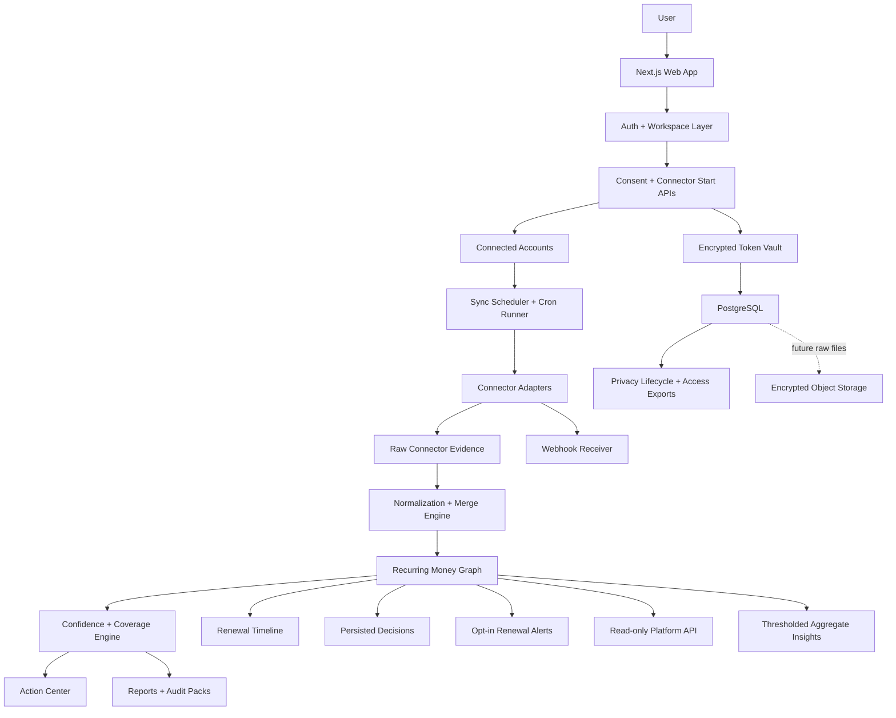

# Vognary Product Architecture

## Positioning

Vognary is the evidence-first recurring-money command center for founders, builders, teams, freelancers, and modern households. It turns receipts, statements, SaaS bills, cloud costs, domains, app-store renewals, UPI AutoPay, card mandates, EMIs, SIPs, insurance, utilities, and manual commitments into one trusted recurring-money graph.

The product must answer, with proof:

1. What am I committed to paying again?
2. What renews next, and what will it cost?
3. What source proved it?
4. What source is missing?
5. What should I keep, cancel, downgrade, negotiate, investigate, or monitor?

Every recommendation carries its evidence, and every gap is named instead of papered over. A product that tells the truth about evidence beats a product that pretends.

## Operating System

The product is organized around eighteen durable surfaces:

| Surface | What it does | Where it lives |
| --- | --- | --- |
| Recurring Money Graph | One deduplicated graph of recurring commitments with cadence, cost, and confidence | `src/lib/recurring-audit.ts`, `/app` section 02 |
| Canonical Living Ledger | Connector batches plus revisioned upload/manual workspace state idempotently materialize normalized sources, evidence, transactions, recurring items, evidence links, coverage, and usage observations | `src/lib/server/living-ledger-store.ts`, `workspace-state-materializer.ts`, migrations `0003` and `0012` |
| Living Proof Graph | Typed commitment/evidence/source/merchant/rail/action/saving nodes, temporal edges, explainable confidence, and append-only hash-chained workspace events | `src/lib/server/proof-graph-store.ts`, `ledger-event-store.ts`, migration `0018` |
| Cited Ledger Answers | Natural questions compile to bounded deterministic graph queries; every claim must resolve to a returned citation and unsupported questions fail closed | `src/lib/proof-questions.ts`, `/api/workspaces/current/ask`, `/app` Ask your proof |
| Evidence Ledger | Every item links to the statement rows, receipts, and connector records that proved it | `RecurringItem.evidence`, `connector_evidence`, `evidence_links`, selected-item proof panel |
| Renewal Calendar | Projected next debits over a 45-day horizon with bucket totals | `src/lib/renewal-timeline.ts`, `/app` calendar panel |
| Renewal Alerts | Explicitly opted-in 7-day/1-day reminders with deduplicated schedules and bounded email retries | `src/lib/server/renewal-alert-store.ts`, `/api/renewal-alerts/preferences`, internal due worker |
| Source Coverage Map | Which evidence rails are represented and which are still missing | coverage signals in `/app` section 04 |
| Action Center | Keep / watch / downgrade / cancel / investigate labels plus safety-checked, persisted decisions on canonical items | `commitment_decisions`, `/api/workspaces/current/decisions`, priority panel |
| Permissioned Outcome Loop | Exact one-action authorization, operator/system transition separation, same-source verification windows, checksummed savings receipts, and capped fee invoices | `src/lib/server/outcome-case-store.ts`, `outcome-verification-store.ts`, migrations `0019`–`0020` |
| Connector Control Plane | Registry, start/sync planning, honesty states, adapters, token vault | `src/lib/connectors.ts`, `src/lib/connector-runtime.ts`, `src/lib/connectors/*`, `/api/connectors/*` |
| Trust, Consent & Privacy Lifecycle | Resource-scoped consent, complete access exports without credential material, retention policy/enforcement, raw-payload minimization, delete paths, and profile controls | `/profile`, `/api/privacy/*`, `src/lib/server/privacy-lifecycle-store.ts`, `retention-executor.ts` |
| Team Review Workflow | Revisioned encrypted owners/notes/review/merge state plus relational canonical commitment decisions | `/app` section 03, `workspace_states`, `commitment_decisions` |
| Adaptive Workspace | Personal/family/founder/team modes change collaboration language and controls without fragmenting the canonical product | `workspaces.workspace_type`, `/api/workspaces/current`, `/app` |
| Installable Private Shell | PWA manifest/icons and an offline fallback; only public static assets are cached, never workspace navigation or APIs | `src/app/manifest.ts`, `public/sw.js`, `/offline` |
| Scheduled Source Refresh | Scheduled sync jobs, cron runner, evidence refresh | `/api/internal/sync-jobs/*`, `vercel.json` cron |
| Read-only Platform API | Expiring, revocable, hashed tokens expose cursor-paginated canonical ledger/decisions and source health through explicit read scopes | `/api/platform/tokens`, `/api/v1/ledger`, `/api/v1/sources` |
| Privacy-safe Benchmarks | Opt-in category/currency/frequency aggregates use prior-day data, workspace-level contribution caps, coarsening, and a 25-workspace minimum | `/api/workspaces/current/benchmarks`, `src/lib/aggregate-insights.ts` |
| Partner Rail Readiness | Explicit AA/UPI/card-mandate partner status tracked as env truth | `src/lib/partner-rails.ts`, `/api/readiness` |

## Module Map

The codebase is modular; each engine has one home and a typed contract:

| Module | Files |
| --- | --- |
| Audit engine (recurrence, cadence, confidence, merge, price change, duplicate resolution) | `src/lib/recurring-audit.ts` |
| Renewal timeline engine | `src/lib/renewal-timeline.ts` |
| Proof graph engine (source diversity, freshness, next-best-source) | `src/lib/proof-graph.ts` |
| Durable proof graph + workspace event ledger | `src/lib/server/proof-graph-store.ts`, `ledger-event-store.ts` |
| Cited proof-question compiler | `src/lib/proof-questions.ts`, `src/lib/server/proof-question-store.ts` |
| Verified savings engines (local projection + durable permissioned outcomes) | `src/lib/verified-savings.ts`, `src/lib/server/outcome-case-store.ts`, `outcome-verification-store.ts` |
| Review diff engine (month-over-month changes) | `src/lib/review-diff.ts` |
| Audit-pack integrity (offline SHA-256 self-checksum, optional Ed25519 issuer signature, verifier) | `src/lib/audit-pack.ts`, `src/lib/server/audit-pack-signing.ts`, `/verify` |
| Redaction engine (PII masking for exports/previews) | `src/lib/redaction.ts` |
| Statement format registry (Indian bank header fingerprints) | `src/lib/statement-formats.ts` |
| Guided proof capture (mandate/app-store screen walkthroughs) | `src/lib/guided-capture.ts`, `src/app/guided-capture-panel.tsx` |
| Parser/ingestion engine (CSV, PDF, receipts, pre-debit notices) | `src/app/api/ingest/route.ts`, `src/lib/receipt-parser.ts` |
| Merchant normalization | `normalizeMerchant` + rules in `src/lib/recurring-audit.ts` |
| Connector registry + honesty states | `src/lib/connectors.ts` |
| Connector runtime (start/sync planning, env truth) | `src/lib/connector-runtime.ts` |
| Connector adapters (OpenAI, Gmail, GitHub Copilot, Vercel, Render, Cloudflare) | `src/lib/connectors/*.ts` |
| Token vault (AES-256-GCM encrypt/decrypt, fingerprints) | `src/lib/server/token-vault.ts`, `src/lib/server/connector-token-store.ts` |
| Workspace/auth layer (signed sessions, magic links, Google OAuth) | `src/lib/server/session.ts`, `magic-link-auth.ts`, `google-auth.ts`, `workspace-auth.ts` |
| Sync scheduler + runner | `src/lib/server/sync-job-store.ts`, `connector-sync-runner.ts`, `/api/internal/sync-jobs/*` |
| Canonical living-ledger materializer | `src/lib/server/living-ledger-store.ts`, `src/lib/connector-evidence-normalizer.ts` |
| Revisioned workspace state + upload/manual materializer | `src/lib/server/audit-snapshot-store.ts`, `workspace-state-materializer.ts`, `/api/workspaces/current/audit-snapshot` |
| Persisted commitment decisions + safety policy | `src/lib/commitment-decisions.ts`, `src/lib/server/commitment-decision-store.ts`, `/api/workspaces/current/decisions` |
| Renewal-alert preferences, scheduler, mailer, and worker | `src/lib/renewal-alerts.ts`, `src/lib/server/renewal-alert-store.ts`, `renewal-alert-mailer.ts`, `/api/renewal-alerts/preferences`, `/api/internal/renewal-alerts/due/run` |
| Webhook receiver (HMAC verification, event persistence) | `src/lib/webhook-signature.ts`, `src/lib/server/webhook-store.ts`, `/api/connectors/[id]/webhook` |
| Privacy lifecycle + access exports | `src/lib/privacy-lifecycle.ts`, `src/lib/server/privacy-lifecycle-store.ts`, `retention-executor.ts`, `/api/privacy/*` |
| Read-only platform API | `src/lib/platform-api.ts`, `src/lib/server/platform-api-token-store.ts`, `/api/platform/tokens`, `/api/v1/*`, `docs/api/openapi.yaml` |
| Thresholded aggregate insights | `src/lib/aggregate-insights.ts`, `src/lib/server/aggregate-insight-store.ts`, `/api/workspaces/current/benchmarks` |
| Persistence/repository layer | `src/lib/server/*-store.ts`, `src/lib/server/database.ts`, `infra/postgres/schema.sql` |
| Reporting/export layer | JSON/PDF/CSV exports in `src/app/vognary-mvp-client.tsx` |
| Readiness/ops layer | `/api/health`, `/api/readiness`, `scripts/check-*.mjs`, `scripts/backup-*.mjs` |
| Monitoring | `src/lib/server/monitoring.ts`, `/api/internal/monitoring/test` |
| Rate limiting | `src/lib/rate-limit.ts` (atomic Postgres buckets with optional Upstash priority; fails closed without a shared backend) |

## Intelligence Rules (current engine behavior)

- Recurrence detection groups debits by normalized merchant and infers cadence against weekly → yearly frequency models with tolerance and consistency checks.
- Month-based cadences anchor next-debit prediction to the historical charge day of month (charge on the 6th predicts the 6th, clamped for short months).
- Next expected dates are never in the past: predictions roll forward cycle by cycle, and items more than one unproven cycle behind carry a `stale evidence` risk tag.
- Single-occurrence charges in recurring-by-nature categories (insurance, domains, EMI, SIP, utilities, app stores) or with renewal keywords surface as `investigate` candidates instead of silently disappearing — this is how annual renewals seen once are caught.
- Cross-source evidence merges: a statement row, a Gmail receipt, a pasted snippet, and connector evidence describing the same commitment (same merchant, compatible cadence, amounts within 25%) become one item with all proof rows, union of sources, a confidence boost, and a `multi-source verified` tag. Incompatible amounts stay separate items.
- Price changes are flagged when a stable run of amounts shifts by ≥8% and ≥₹25; an increase escalates `keep` to `watch`. Fluctuating usage bills are excluded (variance gate) and carry `variable amount` instead.
- Pasted receipt text is parsed into ledger candidates (not just coverage) and merges with matching statement evidence.
- Manual items with past renewal dates roll forward and carry a `renewal date passed` tag.

## Connector Honesty States

Beyond the four registry statuses (`live`, `ready-with-env`, `partner-required`, `planned`), every connector resolves to a fine-grained honesty state at runtime:

`live` · `usage-only` · `source-health-only` · `setup-ready` · `token-required` · `oauth-required` · `verification-required` · `partner-gated` · `blocked` · `evidence-only` · `planned`

The state is derived from status + auth type + environment configuration (`getConnectorHonestyState` in `src/lib/connectors.ts`, env-aware wrapper in `connector-runtime.ts`), surfaced in `/api/connectors` and on `/sources`. A connector may never claim more readiness than its weakest missing requirement.

A connector is only "real" at its declared materialization level when: the user can connect through an official path, tokens are encrypted at rest, sync persists the declared financial/usage/inventory evidence, errors are actionable, disconnect/delete works, and source coverage updates. Inventory-only adapters do not claim spend.

## Delivery Status: Code-Complete vs Production-Active

"Implemented" in this document means the typed code, schema/migration, authorization boundary, and tests exist in the repository. It does
not mean the capability is active in a deployed environment. Production activation additionally requires the relevant migration,
credentials, worker/scheduler, provider approval, and an end-to-end proof run.

| Capability | Code-complete boundary | Production activation gate |
| --- | --- | --- |
| Connector living ledger | Sync normalization idempotently writes canonical connector evidence, transactions, recurring items, evidence links, coverage, and usage observations | Apply `0003`; configure PostgreSQL, encrypted credentials, provider access, and sync workers; prove a real account sync |
| Persisted decisions | Members can read/write safety-checked keep/watch/downgrade/cancel/investigate decisions for canonical connector items; encrypted revisioned state preserves all review actions across devices | Apply migrations and exercise authenticated UI/API; promote remaining workflow fields to relational tables only when multi-user query/approval requirements demand it |
| Renewal alerts | Explicit consent, preferences, 7-day/1-day scheduling, deduplication, bounded retries, safe email templates, and due worker are implemented | Apply migrations; verify Resend sender/domain, configure secrets and the deployed cron, then prove opt-in, delivery, disable, and cancellation |
| Privacy lifecycle | Bounded policies, complete requester access exports, dry-run-first minimization, audit records, stale-webhook dead-lettering, and authenticated daily enforcement cron are implemented | Configure shared rate limiting, cron secret, backup/restore proof, review dry runs, then monitor destructive runs |
| Read-only platform API | Hashed, expiring, revocable tokens and cursor-paginated scoped `/api/v1/ledger` and `/api/v1/sources` endpoints are implemented with an OpenAPI contract | Configure database/shared rate limiting, issue an admin token, and complete a consumer integration test |
| Thresholded aggregate insights | Consented workspaces contribute workspace-bounded category/currency/frequency statistics; daily coarsened results fail closed below 25 workspaces | Build a cohort of at least 25 actively opted-in workspaces with prior-day canonical items. Until then the endpoint correctly returns no benchmarks |
| Living Proof Graph and cited answers | Relational graph/event projection, explainable confidence, protected graph API, and citation-invariant natural query compiler are implemented | Apply `0018`; exercise an authenticated materialization and cited query; configure signing only when issuer proof is desired |
| Permissioned verified outcomes | Exact versioned authorization, safe transition roles, proof-only receipt minting, disputes, invoices, privacy export, and daily verification worker are implemented | Apply `0019`–`0020`; obtain legal/privacy/operations approval; configure `CRON_SECRET`; prove one real end-to-end case before exposing the surface |

CSV/PDF/paste/manual evidence and connector evidence now converge into normalized PostgreSQL ledger rows. The encrypted `workspace_states`
record remains authoritative for UI workflow fields and source text, with optimistic revisions preventing silent multi-device overwrite.

## Code-Complete in the Repository

- Stateless recurring audit: CSV/PDF/paste/manual/receipt-text analysis with warnings.
- Renewal calendar with 45-day projected debits and bucket totals (UI + `/api/audit` response + export pack).
- Evidence merge across statements, receipts, manual entries, and connector evidence.
- Proof Graph panel: single-source vs multi-source spend, stale-evidence spend, and ranked next-best-source by monthly amount at stake.
- Living Proof Graph persistence: typed nodes/temporal edges, hash-chained events, explainable confidence snapshots, authenticated graph reads, and cited natural-language queries that cannot emit uncited claims.
- Permissioned outcome cases: exact one-commitment authorization, customer withdrawal/dispute, operator execution states, system-only verification, same-source proof windows, durable receipts, and capped success-fee invoices.
- Privacy export v2 includes the graph/event history, exact new authorization text, action cases, verification windows, saving receipts, and fee invoices while excluding credentials and internal payload hashes.
- Adaptive personal/family/founder/team workspaces and a privacy-safe installable shell that never offline-caches financial pages or APIs.
- Audit-pack integrity: every export is canonicalized and carries an offline SHA-256 self-checksum plus local chain metadata. When an authenticated workspace exports while signing is configured, the server signs only the hash and issuance metadata with Ed25519. `/verify` keeps report content in the browser, fetches public keys, and distinguishes checksum integrity from trusted, invalid, or unavailable issuer signatures. A checksum alone is not evidence of Vognary authorship, and even a valid issuer signature does not certify the underlying financial claims.
- Verified Savings: cancel/downgrade decisions are proven by watching predicted debits stop appearing inside covered evidence (watching → verifying → verified / not-eliminated).
- Guided Proof Capture wizard for GPay/PhonePe/Paytm/Play/App Store/bank e-mandate screens producing user-confirmed evidence.
- RBI pre-debit/e-mandate notification parsing (day-first dates, mandate merchants) through the receipt path.
- Month-over-month review diff: completed reviews snapshot locally and the next review opens with added/removed/price-changed commitments.
- Explainable duplicate resolution: near-miss pairs surface with reasons; user merge decisions recompute all totals.
- PII redaction (Aadhaar/card/PAN/IFSC/phone/account/UPI handles) in exported evidence and PDF previews.
- Indian bank statement format detection (HDFC/ICICI/SBI/Axis/Kotak fingerprints) with parse-confidence labeling.
- Revocable signed sessions plus Resend magic-link and Google identity flows (env-gated); code login is explicitly disabled in production and available only as an email-bound development aid outside production.
- Google OAuth identity + Gmail read-only receipt connector with state validation and encrypted token persistence (env-gated; public use pends Google verification).
- Automatic encrypted revisioned workspace state (hydrate/debounced save/conflict/delete/resume) for signed-in users.
- Transactional normalized materialization of CSV/PDF/paste/manual evidence with stale-row cleanup and stable recurring UUIDs.
- Connector-derived living ledger: successful normalized batches idempotently upsert relational sources, evidence, transactions, recurring commitments, evidence links, coverage, and usage observations without duplicating provider retries.
- Persisted commitment decisions for canonical items, with member authorization, protected-class action policy, audit logging, and UI hydration from PostgreSQL.
- Consent-gated renewal alerts: authenticated preference API, 7-day/1-day schedules, idempotent delivery rows, bounded retry worker, and privacy-minimized operational responses. Email delivery remains an activation gate.
- Privacy lifecycle: bounded workspace policies, complete requester access exports without credential material, dry-run-first raw-payload/error minimization, product-event deletion, retention audit records, stale verified-webhook dead-lettering, and daily authenticated Vercel Cron enforcement.
- Read-only platform API with one-time plaintext token issuance, stored SHA-256 hashes, explicit `ledger:read`/`sources:read` scopes, expiry/revocation, token/network rate limits, request IDs, and an OpenAPI contract.
- Opt-in aggregate benchmarks limited to category, currency, and frequency; prior-day workspace-level contributions are capped/coarsened and cohorts under 25 workspaces fail closed.
- Connector registry (42 targets), start/sync planning APIs, honesty states, and six registered token-backed adapters (OpenAI costs, Gmail receipts, GitHub Copilot metrics, Vercel domains, Render services, Cloudflare accounts).
- Encrypted token vault, internal-secret-gated sync job API, Vercel-cron-compatible due-job runner, HMAC-verified webhook receiver.
- Atomic shared rate limiting through Postgres, with optional Upstash priority and production fail-closed behavior when neither backend is usable.
- PostgreSQL schema + forward-only migration runner, encrypted backup + restore-drill scripts with S3/R2 upload, ops preflight and production activation checks, monitoring delivery test (Sentry/Better Stack), partner-rail status validation.
- Regression tests cover the audit/timeline/parser engines, security boundaries, connector lifecycle, privacy lifecycle, alerts, decisions, API scopes, and aggregate fail-closed behavior (`npm test`).

## Not Included Yet (honest gaps)

- Public Gmail sync for non-test users (Google restricted-scope verification pending).
- First-class relational owner/note/approval tables. These fields are already durable and conflict-safe inside encrypted revisioned workspace state; separate tables remain a future multi-user querying/approval optimization.
- Encrypted raw-file object storage with retention controls.
- Account Aggregator, UPI AutoPay, and card e-mandate direct sync (regulated partner access required; manual evidence paths are live).
- Apple/Google Play user-wide subscription APIs (do not exist for third parties; receipt/manual evidence is the honest path).
- General-purpose or protected-category cancellation automation. The implemented concierge is restricted to eligible actions, one explicit authorization, and production approval gates.
- Checkout methods beyond tracked Razorpay Payment Links.
- Production benchmark output before 25 distinct workspaces explicitly opt in; the code intentionally returns no cohort below that threshold.

## External Production Activation Gates

These are deployment or business dependencies, not missing application modules:

1. Apply the forward-only PostgreSQL migrations through `0021` and verify `schema_migrations` before enabling dependent routes.
2. Complete Google OAuth restricted-scope verification before opening Gmail receipt sync beyond approved test users.
3. Verify the Resend domain/sender and configure email, session, database, encryption, cron, and shared-rate-limit secrets before enabling public magic links or renewal delivery.
4. Activate and monitor three distinct worker paths: connector sync cron, renewal-alert cron, and the fixed-policy authenticated privacy-retention GET cron.
5. Prove backup upload and restore, monitoring delivery, shared-rate-limit readiness, and incident contacts before storing production financial evidence.
6. Obtain provider credentials/account permissions for each direct SaaS/cloud connector; registry presence does not grant production data access.
7. Sign provider contracts and complete legal/security review for any commercial data partnership.
8. Obtain AA/FIU/TSP and PSP/bank/issuer approvals for regulated bank, UPI AutoPay, or card-mandate rails; code cannot substitute for those permissions.

## Target Architecture

## Build Order (next)

1. Keep the stateless audit + engine tests green on every change.
2. Apply migrations in a disposable/staging PostgreSQL database and run end-to-end proofs for living-ledger sync, decisions, renewal alerts, privacy dry-run/actual retention, API tokens, and benchmark fail-closed behavior.
3. Activate production worker/email/monitoring/backup gates and add readiness evidence for the external POST retention schedule.
4. Complete Google verification for Gmail restricted scope; then open Gmail sync beyond approved test users.
5. Materialize upload/manual audits into the same relational ledger and move snapshot-backed owners/notes/review/merge state into typed tables.
6. Promote additional billing/usage adapters only after real sandbox/account credentials prove normalization, retry, disconnect, and deletion paths.
7. Advance AA/TSP and mandate partner conversations using `docs/partner-rails-access-playbook.md`; track status only through the partner-rail envs.
8. Add usage-aware recommendations (connector usage observations vs. plan cost) per adapter.

## Security Position

- No bank password storage, no card numbers, no SMS scraping.
- Read-only integrations only; OAuth state validation everywhere.
- AES-256-GCM token vault with key fingerprints; secrets never returned by APIs.
- Rate limiting fails closed in production; security headers + CSP configured.
- User-controlled local/snapshot deletion and connector disconnect with local token-material erasure; broader erasure remains subject to workspace ownership and the assisted privacy path.
- Dry-run-first privacy retention minimizes expired raw connector data and operational errors while preserving normalized facts and auditability; production enforcement requires the authenticated Vercel cron plus observed audited runs.
- Renewal emails and aggregate benchmarks are off without purpose-specific opt-in; benchmark cohorts below 25 workspaces return no result.
- Encrypted backup upload and a successful restore drill are required before storing production user financial files.
- Honest connector states; partner-gated rails cannot be claimed live via UI copy.
