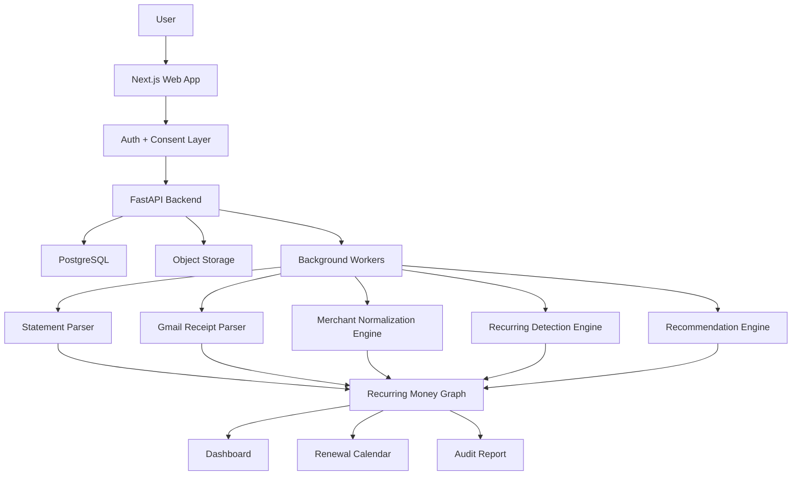

# Vognary Product Architecture

## Positioning

Vognary is the recurring-money intelligence layer for people and teams who pay for too many tools, services, mandates, and subscriptions.

The first proof is simple: we found avoidable annual recurring spend and showed the evidence.

## MVP Scope

The current implementation is a browser-local audit app. It intentionally avoids storage, bank passwords, and regulated integrations while the value proposition is being validated.

### Included Now

- CSV statement upload and paste.
- Transaction parsing with Date, Description, Amount or Debit/Credit columns.
- Merchant normalization.
- Recurrence detection by cadence and amount stability.
- Next expected debit prediction.
- Monthly and annual recurring burn.
- Reviewable burn estimate.
- Recommendation labels: keep, watch, downgrade, cancel, investigate.
- Evidence trail per recurring item.
- JSON report export.

### Not Included Yet

- PDF text extraction and conservative transaction conversion.
- Gmail OAuth receipt scan endpoint and receipt candidate parser.
- Account Aggregator integration.
- UPI/card mandate APIs.
- Cloud/SaaS direct connectors.
- User accounts and persistent storage.

## Target Architecture

## Build Order

1. Prove local CSV recurring detection.
2. Improve PDF table parsing beyond the current text heuristic.
3. Complete Gmail OAuth verification and connect the receipt candidates into the UI.
4. Add user accounts and encrypted storage.
5. Add team workspaces and shared audit reports.
6. Add cloud/SaaS connectors for OpenAI, Anthropic, GitHub, Vercel, Render, AWS, and domains.
7. Add Account Aggregator through a partner/TSP path.
8. Add UPI/card mandate intelligence where API access is available.

## Security Position

- No bank password storage.
- No card number storage.
- No SMS scraping in the MVP.
- Read-only integrations only.
- Evidence-first recommendations.
- User-controlled data deletion before persistent storage ships.
- Encryption at rest for uploaded files once backend storage exists.