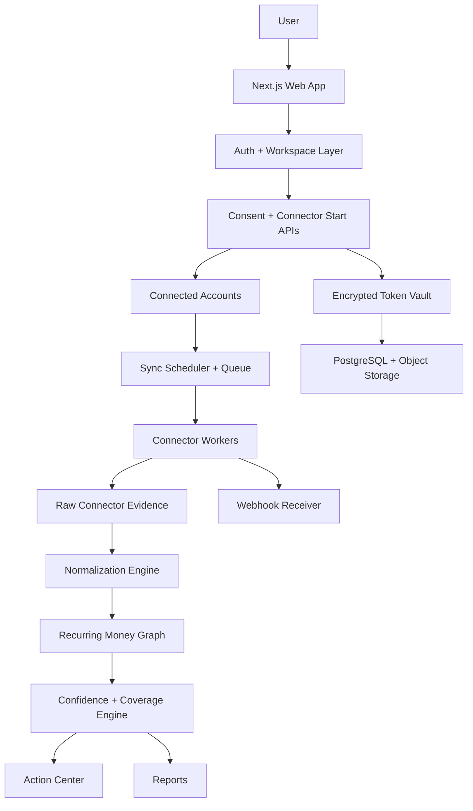

# Vognary Product Architecture

## Positioning

Vognary is the recurring-money intelligence layer for people and teams who pay for too many tools, services, mandates, subscriptions, and cloud/SaaS seats.

The wedge is evidence-first recurring spend: every recommendation must explain which source proved it, which source is missing, and whether direct sync is live, planned, or partner-gated.

## Current Scope

The current implementation is a stateless audit product plus a connector control plane. It intentionally avoids server-side storage, bank-password collection, and fake regulated integrations while the connected-account backend is being built.

### Included Now

- Structured statement upload and paste fallback.
- PDF text extraction and conservative transaction conversion with warnings.
- Transaction parsing with Date, Description, Amount or Debit/Credit columns.
- Merchant normalization.
- Recurrence detection by cadence and amount stability.
- Next expected debit prediction.
- Monthly and annual recurring burn.
- Recommendation labels: keep, watch, downgrade, cancel, investigate.
- Evidence trail per recurring item.
- Receipt snippet parsing.
- PDF, CSV, JSON, and local workspace backup exports.
- Browser-local opt-in save/delete.
- Gmail read-only OAuth preview with state validation and no token persistence.
- Connector registry with 39 targets and explicit live/planned/partner-required states.
- Connector start/sync planning APIs.
- OpenAI organization costs adapter for env-gated read-only sync preview.
- API rate limiting on public/heavy endpoints.
- PostgreSQL schema for connected accounts, token refs, sync jobs, webhook events, evidence, usage observations, and audit logs.
- Token-vault encryption primitives and connector token-store functions for the future connected-account backend.

### Not Included Yet

- Production identity provider or magic-link login. Signed session and workspace authorization primitives exist, but users cannot authenticate until a login issuer is wired.
- Application database wiring and migrations.
- Encrypted token vault and refresh-token rotation.
- Durable connector adapters that persist evidence through authenticated per-workspace sync. The OpenAI adapter can call the provider today as a stateless env-gated preview.
- Authenticated routes that expose connected-account/token-store writes to users.
- Queue workers, sync scheduler, retry/dead-letter handling.
- Webhook receiver and signature verification.
- Account Aggregator integration.
- UPI/card mandate APIs.
- Production monitoring, tracing, alerting, backups, and incident response.

## Target Architecture

## Build Order

1. Keep stateless recurring audit stable and validated.
2. Wire auth, workspace membership, and account deletion.
3. Apply database migrations and repository layer against the existing schema.
4. Add encrypted token vault and consent lifecycle.
5. Convert Gmail preview into persistent connected-account sync.
6. Add queue workers and sync run execution.
7. Promote the OpenAI cost preview into persisted per-workspace sync once auth and token storage are exposed.
8. Add AWS Cost Explorer, GitHub/Copilot, Cloudflare, Render, Vercel, and domains.
9. Add webhook receiver and signature verification for providers that support it.
10. Add Account Aggregator through a partner/TSP path.
11. Add UPI/card mandate intelligence where API access is available.

## Security Position

- No bank password storage.
- No card number storage.
- No SMS scraping in the MVP.
- Read-only integrations only.
- Evidence-first recommendations.
- User-controlled data deletion before persistent storage ships.
- Encryption at rest for uploaded files once backend storage exists.
- Rate limiting on public/heavy APIs.
- OAuth state validation before provider callbacks are accepted.