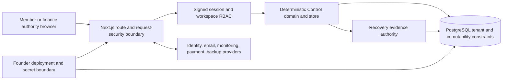

# Commitment Control threat model

> **Operating sequence: Make it work. Make it perfect. Make it fast. Make it cheap.**
> **Strategy rule: Take smart risks. Do not play safe.** Pursue asymmetric,
> falsifiable upside while bounding irreversible customer harm. Product law:
> [`../THE-LAW.md`](../THE-LAW.md). Incident procedure:
> [`incident-response-runbook.md`](incident-response-runbook.md).

**Version:** 1.0, 2026-09-01
**Status:** Internal baseline for independent review; not a certification
**Owner:** Founder, with an independent assessor required before customer data

No real customer financial data may enter Vognary until the independent security
assessment and remediation retest exit in this document is satisfied. Before
that point, testing uses synthetic fixtures in isolated workspaces only.

## Scope

In scope:

- authentication, signed sessions, workspace invitations, and role checks;
- Commitment Control policy, proposal, evaluation, decision, evidence-link, and
  reconciliation paths;
- Recovery evidence used to substantiate existing exposure or observed outcome;
- tenant isolation, exact-money integrity, citations, immutability, privacy
  export and erasure, monitoring, backups, and operator access;
- the Next.js application, PostgreSQL schema, deployment configuration, and
  supported webhook ingress used by these paths.

Out of scope for V0:

- cards, wallets, bank rails, purchasing, provisioning, cancellation, and money
  movement;
- Slack, Gmail mailbox OAuth, autonomous agents, and contract negotiation;
- attacks against Razorpay, Resend, Google, Vercel, Neon, or another provider;
- denial-of-service testing against production, social engineering, and real
  customer data during assessment.

## Security objectives

1. **Authorization:** only a current workspace owner or admin can approve, cap,
   or decline a proposal.
2. **Tenant isolation:** a principal from one workspace cannot read, link, or
   mutate another workspace's data.
3. **Financial integrity:** amounts remain exact minor-unit integers with an
   explicit currency; currencies are never silently combined or converted.
4. **Evidence integrity:** observed amounts come from cited Recovery evidence;
   a proposal remains labeled as a user-entered assumption.
5. **Decision integrity:** actor, policy version, action, and approved cap are
   append-only and cannot be rewritten by later evidence.
6. **Confidentiality:** secrets, credentials, raw customer content, and private
   CRM data do not enter source control, public status, or monitoring payloads.
7. **Availability and recovery:** failures close the feature, repeated requests
   do not duplicate decisions, and encrypted backups can be restored.
8. **Accountability:** security claims describe evidence states rather than
   configuration, aspiration, or comparison with another company.

## Assets

| Asset | Required protection | Authority |
| --- | --- | --- |
| Session and invitation tokens | Confidentiality, expiry, revocation, replay resistance | `src/lib/server/session.ts`, workspace invite store |
| Workspace membership and roles | Integrity and current authorization | workspace membership store and route guards |
| Proposal assumptions | Tenant confidentiality and immutable provenance | Commitment Control store and PostgreSQL constraints |
| Policy evaluations | Determinism, version identity, reason-code integrity | `src/lib/commitment-control/policy.ts` |
| Human decisions and caps | Owner/admin authority, append-only integrity | `decision.ts`, migrations 0057 and 0059 |
| Recovery evidence and citations | Tenant isolation, source provenance, integrity | Recovery store and composite foreign keys |
| Reconciliations | Same-workspace evidence, exact comparison, append-only history | `reconcile.ts`, migration 0057 |
| Secrets and provider credentials | Confidentiality and authenticated encryption | token vault and deployment secret stores |
| Backups | Confidentiality, integrity, recoverability | backup manifest, AES-GCM dump, object restore drill |
| Audit and product events | Privacy-safe accountability and bounded retention | audit/event stores; retention remains a residual risk |

## Actors

- **Member/requester:** may submit a proposal and read permitted workspace state;
  cannot authorize.
- **Owner/admin:** may set policy and authorize, cap, or decline; this is a high
  impact role and may still act maliciously or from a compromised account.
- **Founder/operator:** controls deployment configuration, enrollment, secrets,
  migrations, monitoring, and incident response.
- **Provider:** Vercel, Neon, Google identity, Resend, monitoring, object storage,
  and the hosted payment provider operate separate trust domains.
- **External attacker:** unauthenticated or authenticated through a compromised
  account, seeking access, tampering, replay, disruption, or secret disclosure.
- **Independent assessor:** receives bounded staging access and approved source
  artifacts, never production secrets or customer data.

## Trust boundaries

1. **Browser to edge:** all input is hostile. Runtime DTO validation, body limits,
   origin/CSRF checks, secure cookies, and rate limiting apply.
2. **Edge to authorization:** a valid cookie is insufficient; each protected
   request rechecks the server-side session and current workspace membership.
3. **Authorization to Control:** route role checks and store checks must agree.
   Members can propose; only owners/admins can decide.
4. **Control to Recovery:** proposal values are assumptions. Existing exposure
   and observed outcomes require same-workspace evidence citations.
5. **Application to database:** callers are not trusted to preserve tenancy or
   immutability; composite keys, checks, triggers, versioning, and idempotency do.
6. **Operator to production:** repository access does not imply production
   authority. MFA, least privilege, secret custody, and two-person review are
   required operational controls.
7. **Application to providers:** provider configuration is not proof of delivery,
   payment, backup restore, or customer use.

## Threat register

| ID | Threat and impact | Current control evidence | Required validation / residual risk |
| --- | --- | --- | --- |
| T01 | Stolen or forged session reads financial context | HMAC-signed, HttpOnly, SameSite, production-Secure cookies; server-side token hash and expiry | Assess fixation, token replay, logout, account removal, and compromised-device limits. Bulk revocation procedure is not yet proven |
| T02 | IDOR or crafted identifier crosses tenant boundary | Session workspace scope, store filters, composite workspace foreign keys | Gray-box cross-workspace read/write/link tests across every Control route; no open data-impacting finding |
| T03 | Member escalates to approver | Route and store RBAC; member-denied/owner-allowed PostgreSQL route test | Test invitation acceptance, role change, stale session, and concurrent authorization |
| T04 | Cross-site request or XSS records an unauthorized decision | Origin and Fetch Metadata mutation checks, SameSite cookie, CSP and output escaping | Assess all mutations and rich text. CSP retains bounded inline allowances and is not a certification |
| T05 | Amount, currency, cadence, date, or overflow tampering changes exposure | Runtime validation, `bigint` minor units, currency separation, deterministic projection, database checks | Property/adversarial tests and direct API mutation attempts; wrong money is SEV-0 |
| T06 | Uncited or cross-workspace evidence is presented as fact | Recovery authority, citation contracts, composite evidence keys, claims gate | Attempt citation removal/substitution and privacy-export mismatch; uncited financial output must be discarded |
| T07 | Replay or race duplicates policy, proposal, decision, or reconciliation | Idempotency keys, request hashes, ETags/workspace versions, advisory locking, immutable records | Concurrent and stale-version testing on assessed release; duplicate decision is SEV-0 |
| T08 | Forged or replayed inbound mail creates evidence | Svix raw-body signature verification, event id, payload hash, leases, replay fences | Assess timestamp tolerance, duplicate delivery, malformed MIME, and alias guessing with synthetic mail only |
| T09 | Secrets or customer text leak through errors, logs, exports, or analytics | Monitoring sanitization, safe API envelopes, encrypted raw storage, privacy-safe product events | Inspect representative failures and exports. Raw content in telemetry is SEV-0 |
| T10 | Malicious upload exhausts resources or reaches unsafe parsers | Type and size boundaries, bounded parser paths, rate limits | Fuzz supported formats and decompression/resource limits without production DoS |
| T11 | Compromised founder or provider administrator bypasses controls | Separate provider accounts, deployment secrets, audit trails, fail-closed enrollment | MFA/access inventory and emergency credential rotation remain operator evidence, not code proof |
| T12 | Database loss, corruption, or ransomware destroys authorization history | Encrypted dump, manifest checksum, private object storage, disposable restore tooling | Fresh exact-release object upload/download/restore and measured RPO/RTO required before enrollment |
| T13 | Vulnerable or compromised dependency reaches production | Lockfile, `npm ci`, production/full `npm audit`, version overrides | Independent dependency review; SBOM, automated update policy, and secret/static scans are pre-scale work |
| T14 | Abuse or outage prevents timely decisions | Shared rate limiting, health/readiness, bounded timeouts, monitoring abstraction, enrollment kill switch | Prove alert delivery and fail-closed behavior; pilot availability objective is internal until measured |
| T15 | Operator or customer mistakes configuration for proof | Machine-enforced claims, explicit trust states, exact enrollment list | Continue separating configured, independently assessed, paid, observed, and renewed states |

## Independent assessment scope and exit

The assessor receives the assessed commit SHA, synthetic staging accounts for at
least two workspaces and three roles, architecture and threat-model documents,
relevant source and tests, and the disclosure policy. Production secrets,
customer data, destructive production access, provider attacks, and social
engineering are excluded.

Required coverage: authentication and session lifecycle; invitations; RBAC and
IDOR; tenant isolation; CSRF/XSS/CSP; API validation; idempotency and races;
financial and citation tampering; upload/parser boundaries; rate limits; privacy
export and erasure; monitoring redaction; secret handling; dependencies; backup,
restore, and enrollment shutdown.

Exit requires dated scope and retest evidence with:

- zero unresolved Critical or High findings;
- zero unresolved Medium findings affecting authentication, authorization,
  tenant isolation, financial integrity, evidence integrity, privacy, or data
  loss;
- an owner, due date, compensating control, and explicit risk acceptance for any
  remaining Medium finding;
- regression tests for executable remediations and a green exact-SHA release
  gate after fixes.

## Residual risk and review triggers

- The application is a private pilot, not a certified security program.
- A compromised owner/admin can make an authorized but harmful business decision;
  Vognary preserves accountability but does not replace internal governance.
- Provider and endpoint compromise cannot be eliminated by application controls.
- Audit-event archival, key rotation drills, SBOM automation, and measured SLOs
  are incomplete until their separate evidence gates close.
- Re-review this model after any auth, invitation, tenancy, financial authority,
  evidence-source, payment, or provider-boundary change and before more than
  three real-data pilots.