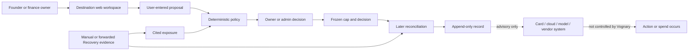
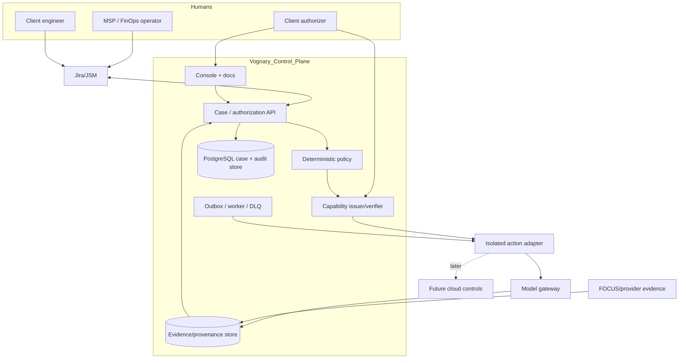
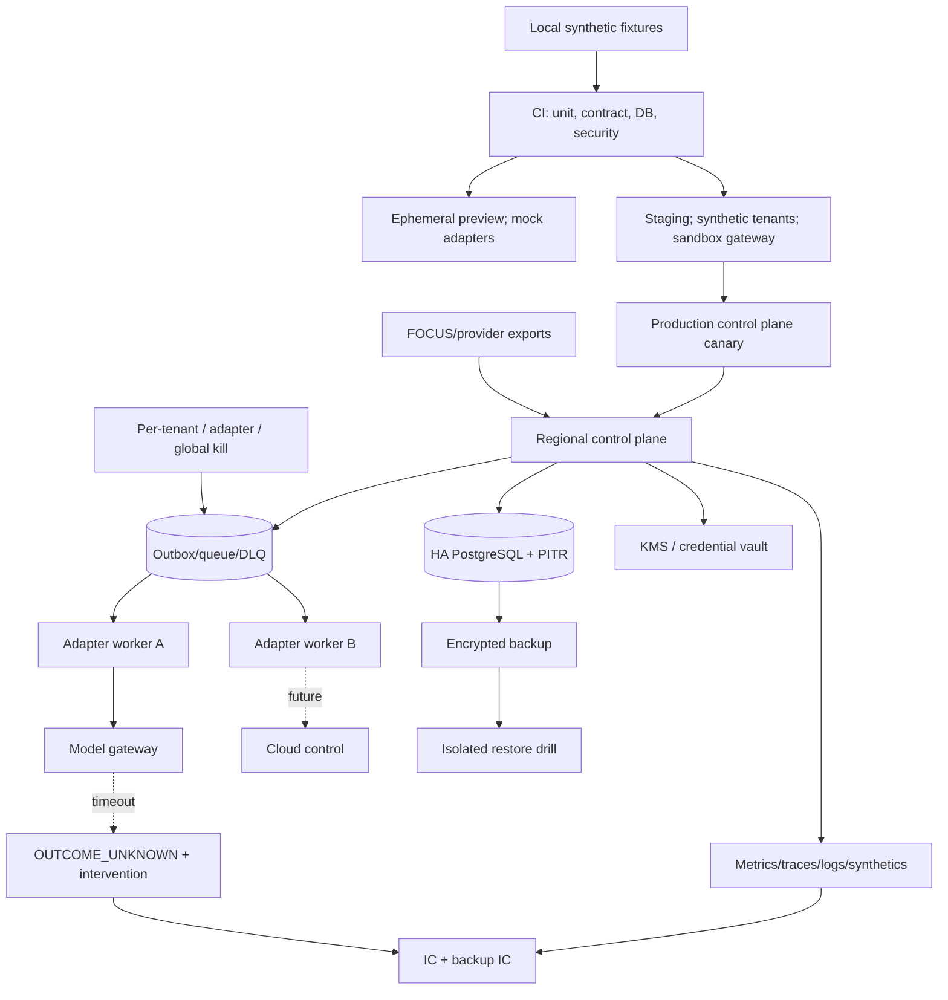
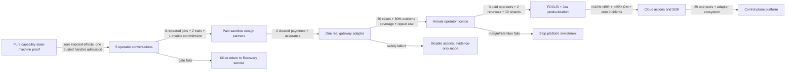

# Vognary zero-to-N reinvention report

> **Operating motto: Take smart risks. Do not play safe.**

**Decision date:** 2026-09-02<br>
**Evidence cutoff:** 2026-09-02 13:03 IST for repository/runtime facts; external pages accessed 2026-09-02<br>
**Decision state:** `PIVOT CANDIDATE`; founder acceptance and C1/C3/R2 commercial comparison pending; pure capability-state-machine proof locally tested<br>
**Evidence vocabulary:** `OBSERVED` | `PRIMARY-SOURCE FACT` | `REPO FACT` | `INFERENCE` | `HYPOTHESIS` | `UNKNOWN`

No item in this report promotes a state across these ladders without evidence:

```text
idea -> specified -> implemented -> locally tested -> CI verified at SHA
  -> deployed -> configured -> observed by a real user -> paid
  -> retained -> expanded -> independently repeated

sourced -> evidence-ready -> contacted -> replied -> behavioral conversation
  -> committed event -> explicit offer -> invoice commitment -> invoice
  -> cleared payment -> activated -> repeated use -> renewal -> expansion
```

## 1. Verdict in 150 words

**PIVOT CANDIDATE, NOT AN ACCEPTED COMPANY DECISION.** C3 proposes a **multi-tenant variance-to-remediation control service for FinOps and managed-service operators**: normalize authoritative technology-cost evidence, identify a material variance, let the operator propose a bounded reversible remediation, require the client’s named authorization, apply only that exact action at a tested control point, and reconcile observed outcome against the frozen decision. C1 fractional-CFO portfolio control and R2 post-spend variance Recovery remain live rivals. Commitment Control remains the canonical company/code direction under `THE-LAW.md` until the founder explicitly decides otherwise; discretionary product and frontend work is paused meanwhile.

The scorecard cannot choose the company: C1 scored `66.85`, C3 `66.80`, and R2 `64.75`. The C1/C3 gap is 0.05, below the scoring method’s resolution, and control ownership was already included in the weighted workflow/control criterion. The fastest bounded decision is five C3 buyer calls that also classify the actual event as C1, C3, or R2; require repeated work, scoped sandbox-credential authority, a committed case, and price-specific invoice behavior.

The likely cause of death is remaining outside the system of action while building a destination workflow that buyers already obtain with cards, procurement suites, native budgets, or gateways. The second cause is operating behavior: 104 changed paths coexist with zero current-thesis conversations, offers, payments, proposals, decisions, or reconciliations.

Confidence is **55–65%** that C3 merits the commercial test, not that it should be selected, and **85–92%** that no candidate should receive more product investment before buyer evidence. Five calls can reject C3 quickly; payment and retained behavior are still required to select any company direction.

## 2. What was inspected

### 2.1 Fresh repository and runtime state

| Evidence | Classification | Result |
| --- | --- | --- |
| `date` | OBSERVED | `2026-09-02T13:03:26+0530 IST` |
| `git branch --show-current` | OBSERVED | `main` |
| `git rev-parse HEAD` | OBSERVED | `89d6ceb16409c3513a7bc31b4ed93c96b7c84507` |
| `git rev-list --left-right --count @{upstream}...HEAD` | OBSERVED | `0 0` |
| `git status --short` | OBSERVED | 104 paths: 81 modified, 23 untracked, 0 deleted |
| Concurrent ownership | OBSERVED + REPO FACT | Opus-owned frontend, screenshots, CSS, tests, brand assets, and `docs/CONTINUE-HERE.md` were already modified. They were preserved. |
| `node --version`; `npm --version` | OBSERVED | Shell initially resolved Node `20.19.0`, npm `10.8.2`; focused proof checks explicitly used required Node `22.23.2`. |
| `npm run market:report` | OBSERVED | 45 rows; 30 unassigned; cohorts 5/5/5 evidence-ready; three contacts; zero replies, conversations, repeated jobs, committed events, offers, invoice commitments, invoices, or payments. |
| `npm run market:cohort-gate` | OBSERVED | Sourcing gate READY; company gate INCOMPLETE at 0/10 offers and 0/2 cleared payments. |
| `npm run funnel` | OBSERVED | 19 signups; zero workspaces with submitted evidence; Control schema available; zero policies, proposals, evaluations, human decisions, or reconciliations; zero returning users on two or more days. Historical checkout rows are explicitly retired evidence. |
| `npm run control:preflight` | OBSERVED | Exit 1: target readiness unavailable, Control migrations missing, no enrolled workspace, incident staffing incomplete, tabletop not passed, legal/logging uncleared, restore not passed, monitoring unproved, review procedure unapproved. |

### 2.2 Repository surfaces inspected

`REPO FACT`: governing doctrine and live state; Phase A and Phase B contracts; existing adversarial reports; package scripts; Control exact-money, policy, decision, and reconciliation modules; read-only Platform API scopes and token store; Control tests; connector runtime and selected provider adapters. Important reusable symbols are:

- `projectProposalExposure`, `evaluateProposalPolicy`, `authorizeProposalDecision`, `reconcileAuthorizedProposal`.
- `createPlatformApiToken`, `authenticatePlatformApiToken`; current scopes are only `ledger:read` and `sources:read`.
- Control PostgreSQL tables from migrations `0057`–`0059`, although the new proof deliberately did not change schema or production data.

### 2.3 Runtime and browser limitation

`UNKNOWN`: this session did not rerun the broad frontend/browser traversal because 104 active paths belong to Opus’s concurrent reconstruction and the founder explicitly prohibited another broad scan. The existing local browser evidence is repository evidence, not re-observed runtime evidence in this report. Cheapest resolution: Opus completes its owned journey gate; founder performs the cold 60-second review; cost 60–90 minutes; deadline 2026-09-03. This does not affect the backend-neutral proof or market verdict.

### 2.4 Primary-source ledger

All pages below were accessed 2026-09-02. “Undated” means the page exposed no reliable publication date. Vendor statements prove product positioning or documented behavior, not independent customer outcomes.

| Ref | Publisher, page, date | Geography | Exact proposition proved | Limitation |
| --- | --- | --- | --- | --- |
| S1 | FinOps Foundation, [What is FinOps?](https://www.finops.org/introduction/what-is-finops/), updated March 2026 | Global | FinOps is cross-functional technology-value management; engineering, finance, product, and business share accountability; AWS, Azure, GCP, OCI and others provide FOCUS data. | Framework, not purchase intent. |
| S2 | FinOps Foundation, [Anomaly Management](https://www.finops.org/framework/capabilities/anomaly-management/), undated current page | Global | Formal workflow is detect, route, investigate, resolve, document, and measure actioned anomalies, time-to-resolution, and avoided spend. | Does not prove a third-party operator will buy Vognary. |
| S3 | FinOps Foundation, [Usage Optimization](https://www.finops.org/framework/capabilities/workload-optimization/), undated current page | Global | FinOps proposes and tracks optimization; engineering performs potentially disruptive remediation; actual versus estimated impact is measured. It explicitly covers agentic AI token expansion. | Prescriptive framework; implementation varies. |
| S4 | FinOps Foundation, [Rate Optimization](https://www.finops.org/framework/capabilities/manage-commitment-based-discounts/), undated current page | Global | Central FinOps coordinates commitment discounts, procurement and finance authorize commercial commitments, and providers/MSPs already manage portfolios as services. | Shows an occupied service category. |
| S5 | FOCUS, [Specification 1.4](https://focus.finops.org/focus-specification/), publication release 1.4, 2026 | Global | Common billing schema supports allocation, budgeting and forecasting independent of data origin. | Normalizes cost evidence; does not authorize remediation. |
| S6 | LiteLLM, [Budgets and rate limits](https://docs.litellm.ai/docs/proxy/users), current 2026 docs | Global | Virtual-key/team/user/agent budgets can reject requests; reservation occurs before provider dispatch; DB-less budgets fail open; optional fail-closed enforcement rejects with 503 when neither Redis nor DB can verify spend. | Open-source/enterprise feature mix and fast-moving behavior require pinned contract tests. |
| S7 | Cloudflare, [AI Gateway dynamic routing](https://developers.cloudflare.com/ai-gateway/features/dynamic-routing/), updated 2026-08-07 | Global | Versioned routes enforce rate/budget limits, select models and fallbacks, use BYOK, and support instant rollback. | Dynamic routes currently require its compatibility endpoint; Vognary would not own this gateway. |
| S8 | Anthropic, [Usage and Cost API](https://platform.claude.com/docs/en/manage-claude/usage-cost-api), undated current docs | Global | Admin credential required; usage can group by key/workspace/model at minute/hour/day buckets; cost is daily; data usually appears within five minutes; Priority Tier cost is excluded. | Provider-specific observed evidence, not an action-level authorization point. |
| S9 | OpenAI, [API overview / administration](https://platform.openai.com/docs/api-reference/organization/costs), current page | Global | Server-side keys or workload federation authenticate; request IDs support outcome investigation; key revocation takes seconds but other auth updates may take up to 15 minutes. | Fetched page redirected to overview; exact cost endpoint schema was not independently extracted. |
| S10 | AWS, [Configuring budget actions](https://docs.aws.amazon.com/cost-management/latest/userguide/budgets-controls.html), undated current docs | Global | Budget thresholds can automatically or manually apply IAM/SCP policies or target EC2/RDS; a deny policy can stop further provisioning. | Provider-specific, coarse action; billing signal latency remains material. |
| S11 | Microsoft, [Azure budgets](https://learn.microsoft.com/en-us/azure/cost-management-billing/costs/tutorial-acm-create-budgets), dated 2025-06-26 | Global | Azure budgets notify; resources are not stopped; cost data is typically 8–24 hours late and evaluated daily; action groups can trigger automation. | Budget is evidence/trigger, not hard authorization by itself. |
| S12 | Google Cloud, [Programmatic budget notifications](https://cloud.google.com/billing/docs/how-to/budgets-programmatic-notifications), updated 2026-08-26 | Global | Pub/Sub events are at-least-once, may be duplicated/out of order and delayed hours; costs are estimates; automation can manage usage or disable billing. | Disabling billing is high-blast-radius and not the V0 action. |
| S13 | MCP, [Draft authorization specification](https://modelcontextprotocol.io/specification/draft/basic/authorization), current draft | Global standard | HTTP MCP authorization uses OAuth resource/audience binding and scope challenges; STDIO should obtain credentials from environment; authorization is optional. | Transport authorization does not bind one business action, amount, or human decision. |
| S14 | OPA, [Open Policy Agent](https://www.openpolicyagent.org/docs/latest/), current v1.20.1 docs | Global open source | OPA separates policy decisions from enforcement and returns structured decisions over structured inputs. | Mature substitute for policy evaluation; not an evidence or human-authorization ledger. |
| S15 | Spendflo, [Pricing](https://www.spendflo.com/pricing), undated 2026 page | Global | Outcome-based/custom pricing, 14-day onboarding claim, intake/approval, audit history, PO/bill matching, payment records, Slack/Teams/email and ERP integrations. | Vendor claim; numeric price and independent outcome unavailable. |
| S16 | Kodo, [Home](https://www.kodo.in/), published 2026-08-28 | India | 2,000+ company claim, startup segment, maker-checker-approver, mailbox/WhatsApp, cards, real-time limits, ERP integrations. | Vendor claim; public API and numeric price not found. |
| S17 | Volopay, [India product](https://www.volopay.com/in/), undated | India/global | Cards, custom spend limits, maker-checker payments, real-time transactions, Tally/Zoho/NetSuite/Xero/QuickBooks, licensed partners and stated SOC 2/ISO/PCI posture. | Vendor claim; partner contract and price are not public. |
| S18 | Ramp, [Pricing](https://ramp.com/pricing), current page on 2026-09-02 | US plus listed international issuance | Free $0 tier; Plus $15/user/month plus platform fee; card/vendor controls, Slack, approvals, payments, procurement add-on, budget versus actual. | Geography and licensed issuers constrain direct India comparison. |
| S19 | Brex, [Spend management](https://www.brex.com/product/spend-management), undated | Global/eligible markets | Policies can block categories/merchants, require approval, issue limits, integrate Slack/WhatsApp and ERPs, and enforce at payment. | Vendor claim and eligible-market constraints. |
| S20 | CERT-In, [Directions index](https://www.cert-in.org.in/Directions70B.jsp), directions dated 2022-04-28; page updated 2026-09-02 | India | Official directions and extension/FAQ are current controlling sources. The underlying direction requires covered entities to report listed incidents within six hours, name a point of contact, synchronize clocks, and retain ICT logs for 180 days in India. | Applicability and Vercel architecture need Indian counsel; this is not demand evidence. |
| S21 | European Commission, [AI Act](https://digital-strategy.ec.europa.eu/en/policies/regulatory-framework-ai), updated 2026-08-03 | EU | Transparency enforcement started 2026-08-02; high-risk duties listed on the page start 2027-12-02 and apply to enumerated high-risk uses. | Not a current mandate for an ordinary Indian FinOps tool. |
| S22 | RBI, [Payment Aggregator/Payment Gateway Guidelines](https://www.rbi.org.in/Scripts/NotificationUser.aspx?Id=11822&Mode=0), 2020-03-17, updated 2020-11-17 | India | Non-bank payment aggregators handling funds require RBI authorization and ₹25 crore ongoing net worth; gateways are technology providers; escrow, KYC, security, audit and dispute duties apply. | Vognary avoids custody and payment execution in the selected wedge. |
| S23 | RBI, [NBFC Account Aggregator Directions](https://www.rbi.org.in/Scripts/BS_ViewMasDirections.aspx?id=10598), 2016-09-02, updated 2024-09-06 | India | AA is a licensed consent-based data-sharing business, must not support transactions, cannot store customer financial information, and FIU eligibility is regulated. | Rules out treating AA as an easy bank-feed connector; it does not govern cloud billing exports. |

`UNKNOWN`: exact DPDP commencement obligations applicable on 2026-09-02 were not recovered from an extractable official Gazette source in this session. Cheapest resolution: Indian privacy counsel maps controller/processor roles and current notifications; owner founder; budget ₹25,000–₹75,000 assumption; deadline before any real pilot data.

### 2.5 Five-role workflow evidence across three geographies

| Role/geography | Trigger and system already open | Authority, irreversible moment, cadence | Incumbent and consequence | Mandatory/renewal proof | Evidence boundary |
| --- | --- | --- | --- | --- | --- |
| Startup finance owner, India | New request, invoice or budget variance; Kodo/Volopay/accounting/chat | Sets budget and approves spend; card/payment or signed contract is point of no return; weekly/monthly | Card/spend suite or founder approval; unsupported spend reaches close | Must prevent or explain exceptions; 30d complete approvals, 90d fewer unresolved variances, 365d audit/renewal evidence | S16–S17 prove available workflow/enforcement, not pain or WTP at Vognary ICP |
| Fractional CFO/CA, India | Client close, invoice or renewal; Tally/Zoho/email/sheets | Usually advisory; client founder acts; monthly/quarterly | Manual chase and accounting suite; labor and missing approval context | Must save portfolio-level work; 30d multi-client reuse, 90d lower chase time, 365d paid renewal | UNKNOWN demand/authority; five prepared candidates are sourcing evidence only |
| MSP/FinOps operator, global/India-serving | Cost anomaly, commitment variance, optimization case; provider console/FinOps platform/Jira | Bridges evidence and stakeholders; engineering performs change, client finance/leadership authorizes tradeoff; daily/weekly | Native anomaly/budget tools, tickets and scripts; unresolved cost accrues | Must close detection→resolution→actual impact; 30d repeated cases, 90d operator-led outcomes, 365d tenant expansion/renewal | S1–S5 and persona pages prove the job; no Vognary buyer has confirmed WTP |
| AI platform/security owner, US/EU/global | Model/gateway/tool rollout or runaway usage; gateway/IAM/MCP/SIEM | Holds technical credential/policy; provider dispatch is point of no return; continuous | LiteLLM/Cloudflare/provider limits/IAM; broad keys or coarse budgets | Must produce zero bypass and bounded blast radius; 30d integration, 90d incident-free repeated use, 365d audit acceptance | S6–S9/S13/S21 prove primitives and regulation scope; not buyer demand |
| Procurement/vendor owner, US/EU/global | Purchase request, contract/renewal, vendor exception; Spendflo/Ramp/Brex/CLM/ERP | Negotiates/contracts; PO/payment is point of no return; event/monthly/quarterly | Intake-to-pay suites with approval and payment; duplicate standalone workflow loses | Must improve cycle/compliance or own payment hold; 30d requests, 90d cycle/outcomes, 365d renewal/contract value | S15/S18/S19 prove occupied workflow and prices, not independent outcomes |

## 3. Reality ledger

### 3.1 Facts versus claims

| Domain | Claim or hope | Measured reality | Consequence |
| --- | --- | --- | --- |
| Product | Commitment Control owns the pre-commitment moment. | OBSERVED: zero proposals, decisions or reconciliations. PRIMARY-SOURCE FACT: card/procurement platforms already combine intake with enforcement. | Ownership is unproved; destination UI is not the control point. |
| Market | Five qualified/direct and ten exploratory candidates imply a beachhead. | OBSERVED: only three contact attempts; zero replies, conversations, committed events, offers or payments. | Sourcing is ready; demand is entirely unknown. |
| Reliability | 1,100+ tests imply readiness. | REPO FACT: code gates are strong. OBSERVED: pilot preflight is blocked on nine rows. | Engineering behavior is not operational readiness. |
| Integration | Connector registry implies coverage. | REPO FACT: many adapters/registry entries exist; current Platform API is read-only; no MCP/capability/workload identity path existed before this proof. | Registry must not be sold as live control. |
| Deployment | Production health/deploy history implies usable product. | OBSERVED: Control migrations/enrollment/readiness remain blocked; no customer evidence submitted. | Deployed shell is not an activated pilot. |
| Company | ₹14,999 pilot and $1M ARR target define a business. | OBSERVED: zero current offers/payments/renewals; the price has no willingness-to-pay evidence. | It is a hypothesis, not a model. |
| Moat | Exact money and immutable decisions are differentiation. | REPO FACT: they are valuable primitives. PRIMARY-SOURCE FACT: OPA, cloud audit logs, gateways and spend products own adjacent primitives. | Moat requires cross-provider outcome data and operator distribution, not code alone. |
| Regulation | AI regulation creates demand now. | PRIMARY-SOURCE FACT: EU transparency is current, but high-risk duties are narrow and later; CERT-In is a Vognary obligation, not buyer pull. | Do not sell compliance urgency unsupported by applicability. |

### 3.2 Current system and workflow



The dashed edge is the strategic defect: Vognary records a decision but does not intercept the action.

### 3.3 Surface truth map

| Surface | User job | Current behavior/source | Status | Failure and consequence | Verdict |
| --- | --- | --- | --- | --- | --- |
| `/` and `/demo` candidate | Understand product | Opus-owned synthetic frontend fixture | Concurrent/unaccepted | Can overstate continuity while live Control stays gated | Freeze; do not use as demand proof |
| `/start` | Submit evidence | Real guest parser and session handoff | Implemented/local evidence | Manual evidence tax; zero current use | Keep as fallback evidence intake |
| `/app` Recovery | Inspect commitments/evidence | Recovery store and deterministic parsers | Implemented, zero observed workspaces | Destination adoption tax | Migrate evidence components, not IA |
| `/app` Control | Propose/decide/reconcile | Control store/domain/API; enrollment gated | Implemented, zero observed use | Advisory outside action path | Freeze UI; reuse domain contracts |
| `/api/v1/ledger`, `/sources` | Export ledger/source health | Hashed expiring read-only tokens | Implemented | No write/action scope | Keep and harden for operator read path |
| Connector registry | Describe possible sources | Registry plus mixed live/ready/planned/partner states | Mixed | Logo theater if status omitted | Keep only status-honest entries |
| Billing/offer | Buy one-month pilot | Current invoice path plus retired history | Concurrent frontend repair; zero offers | Commercial discontinuity | Replace only after commercial proof |
| Autopilot/retired checkout | Historical execution/payment | Frozen code/data and retired routes | Historical | Confuses current funnel | Archive/read-only, then delete unreachable UI |
| New FinOps capability proof | Bind one authorized normalized action to one allowlisted handler admission | Pure JOSE grant + in-memory two-phase ledger + immutable trusted adapter-operation registry | Locally tested only | No durable store, LiteLLM request, provider request, user or payment | Keep isolated; no real adapter until commercial precondition |

## 4. Constraint trial

Every disposition below is a recommendation inside an unaccepted candidate
package. It changes no live rule; `THE-LAW.md` remains authoritative until the
founder records a decision.

| Current rule/choice | Purpose and benefit | Cost now | Judgment | Replacement | Evidence to revisit |
| --- | --- | --- | --- | --- | --- |
| Name `Vognary` fixed | Continuity and accumulated assets | Name carries no clear FinOps meaning | RELAX | Keep for 30-day test; rename only after two paid operators choose category language. | Two paid operators and ten comprehension tests. |
| “Commitment Control” category | Name pre-spend loop | Oracle and spend suites already occupy adjacent meaning; desk is advisory | REPEAL as category | “Authorized FinOps remediation” as literal wedge; no coined category publicly. | Buyer repeats an alternative phrase unprompted in 5/10 calls. |
| India-first entry | Reachability, INR literacy | Indian 20–100 buyer cell unproved; FinOps operators may serve globally | REWRITE | India-founded, global-operator test; local legal/data boundaries per tenant. | At least 3/5 India-serving operators with recurring job and one paid trial. |
| Direct finance owner as first buyer | Holds budget | Lacks delegated technical control; incumbents sell complete spend rails | TEST | Compare C1 direct/advisory ownership, C3 operator ownership, and R2 Recovery behavior before replacing the buyer. | Five C3 calls plus the existing three-cell comparison. |
| 20–100-person AI-native ICP | Narrow reach | Often lacks formal FinOps and sufficient variable spend | REPEAL | First managed tenants have meaningful model/cloud variability; operator can manage multiple tenants. No employee-count gate. | Ten operator-managed tenants with stated monthly technology spend and repeated anomalies. |
| ₹14,999 one-month pilot | Easy fixed offer | May be too low for integration-heavy B2B; neither price has demand evidence | TEST | Keep ₹14,999 as the live offer. ₹75,000 is an unapproved C3 hypothesis; the founder must choose one fixed price before any C3 offer counts. | Ten identical offers; two cleared payments. |
| Founder-delivered | Learn quickly | Does not scale but is correct before productization | KEEP for first three | Founder + operator run weekly variance/remediation review with bounded support. | Operator performs second cycle without founder rescue. |
| Manual proposal workflow | Avoid integrations | Adoption tax; detached from anomaly trigger | REPEAL | Request starts from cost anomaly/ticket; remediation arguments are generated from provider facts and confirmed. | ≥80% of trial requests originate from detected variance. |
| Recovery as only observed evidence | Prevent fabricated money | Receipt-only evidence is too slow for FinOps | REWRITE | Recovery is provenance framework; authoritative sources include FOCUS/provider billing exports and signed provider responses. | Contract tests plus buyer-approved source hierarchy. |
| No Slack/Teams/email | Avoid distraction/security review | Keeps product outside operator workflow | RELAX | First embed is signed webhook/Jira ticket; chat only after demand and scopes are known. | 3/5 operators name same work queue. |
| No cloud/model connector | Avoid unearned integrations | Could block C3 if buyers confirm the job | DEFER | Specify a disposable LiteLLM contract now; build only after a committed case and founder acceptance. | Scoped sandbox credential, contract test, rollback drill. |
| No API | Avoid platform-before-product | Operator model requires multi-tenant integration | REPEAL | Narrow request/status/evidence API with workload tokens and tenant-bound scopes. | Two operators integrate without founder-authored glue. |
| Never act | Bounds harm | May be fatal to C3 but remains correct for live Commitment Control | TEST ONLY | The state-machine proof may simulate an effect. No real action until founder acceptance, commercial evidence, sandbox contract, and assurance gates. | Security review, revocation/rollback tests, paid operator. |
| Never move money | Avoid licensing/custody | Still correct for wedge | KEEP | Partner-only future; Vognary never holds funds in first 12 months. | Licensed partner contract and counsel approval. |
| Single Next.js app | Low operational load | Fine for control plane; gateway hot path may need isolation later | KEEP now | Modular monolith + separately deployable adapter worker only when SLO/credential boundary requires it. | >50 rps sustained or independent credential/isolation requirement. |
| Destination app | Gives complete demo | May create adoption tax and compete with systems already open | PAUSE | Preserve current routes while C1/C3/R2 behavior is measured; do not build the candidate API/ticket path yet. | Buyer names the same incumbent workflow in ≥3/5 calls. |
| Current route/brand system | Supports public narrative | Extensive frontend work and no demand | THESIS-NEUTRAL PAUSE | Preserve Opus's completed candidate and evidence; no further frontend/category work until explicit founder direction. | Founder direction plus paid workflow evidence. |
| Current scoreboards/deadlines | Enforce truth | Optimized around direct-finance Control | REWRITE | Preserve historical rows; add operator job/trial/remediation/outcome rows after founder acceptance. | First five operator conversations. |
| Software subscription assumed | Familiar model | Operator value may be service/channel-led | RELAX | Fixed paid design-partner trial; annual channel licence if repeated use appears. | Two paid trials, one renewal, gross margin >65%. |
| Repository must survive | Preserves trust assets | Can create sunk-cost attachment | REPEAL | Keep only assets that reduce proof time; archive/delete the rest after gate. | File-by-file dependency and usage evidence. |
| Security before all discovery | Protects data | Can become excuse not to interview | REWRITE | Behavioral calls and synthetic trials now; real tenant credentials/data only after scoped assurance exit. | Independent assessment and legal/logging clearance. |

## 5. Root-cause autopsy

### 5.1 Causal diagnosis

1. **No owned control point.** `PRIMARY-SOURCE FACT`: Kodo, Volopay, Ramp and Brex couple policy to cards/payments; LiteLLM and Cloudflare couple budgets to provider routing; AWS can apply IAM/SCP. Current Vognary ends at a record.
2. **Wrong unit of adoption.** `INFERENCE`: one small company has too few material commitments to form habit. An operator managing 10–50 tenants has repeated anomalies, common integrations and one-to-many distribution.
3. **Trigger entered manually.** `REPO FACT`: proposal begins in Vognary. `PRIMARY-SOURCE FACT`: FinOps work begins from billing/allocation/anomaly evidence and flows to engineering resolution.
4. **Buyer, operator and authorizer collapsed.** The finance buyer may not hold gateway/cloud credentials; engineering may act but not authorize; MSP may operate but needs client authority. The product modeled only workspace roles.
5. **Value proof arrived too late or not at all.** Control promised prevention but could not enforce; Recovery could prove observed amounts but was not attached to a remediation action.
6. **Engineering substituted for market contact.** `OBSERVED`: 104 changed paths, 1,100+ tests, and zero current conversations/offers/payments.
7. **Regulation was misused as pull.** CERT-In is a company obligation; EU high-risk scope is narrower/later. Neither proves a buyer budget.
8. **The category was attacked horizontally.** “All commitments” invited comparison with mature procurement/cards. The wedge must be one technically enforceable action with measurable outcome.

### 5.2 Likely death sequence if unchanged

```text
more destination polish -> a few demos -> buyer asks “what does it block?”
  -> answer is “nothing” -> incumbent card/gateway/native budget remains
  -> no repeated proposals -> no outcome data -> no renewal -> company ends
```

### 5.3 Assets, neutrals, anchors

| Class | Assets | Neutral | Anchors to weak thesis |
| --- | --- | --- | --- |
| Domain | Exact minor-unit money; currency separation; deterministic policy; immutable human decision; reconciliation | 13-week projections; current category enum | Manual merchant/cadence proposal contract |
| Data | Evidence provenance; tenant isolation; privacy export/deletion; idempotency | Historical receipt corpus scaffolding | Receipt-only authority for technology cost |
| Platform | Hashed expiring tokens; request IDs; rate limits; audit log | Next.js shell | Read-only-only API and destination-first navigation |
| Company | Honesty discipline; India operating knowledge | Vognary name | Commitment Control category, ₹14,999 direct-finance offer, redesign cycles |

## 6. Thirty-six-thesis opportunity universe and full scores

### 6.1 Thesis contracts

Every ACV below is a **planning assumption**, not a market fact. “Enforcement” describes the proposed product contract, not a live integration.

| ID | Arena, job, first buyer, trigger | Current workflow and control point | Initial product, integrations, enforcement | 30-day proof; assumed entry ACV; expansion; fatal risk |
| --- | --- | --- | --- | --- |
| H1 | Human authorization — record a proposed obligation; startup finance owner; new vendor | Chat/sheet/card; destination record only | Existing Control desk + Recovery; advisory | 10 offers/2 pays; ₹14,999 pilot; more proposals; incumbents enforce |
| H2 | Human authorization — approve where work happens; finance owner; chat request | Slack/Teams/email thread; message action | Embedded approval + immutable record; advisory unless partner | 3 buyers/30 requests; ₹3L/y; workflows; crowded integrations |
| H3 | Human authorization — unify authorizations across rails; controller; audit/close | Multiple systems; cross-system ledger | API/event ledger; system adapters; attest only | One embedding partner; ₹8L/y; system of record; no distribution |
| R1 | Recovery — find renewal waste and prove outcome; CFO; renewal/bill | Bills + spreadsheet; evidence review | Receipt/contract desk; email/accounting; recommendation | 5 bill packs/2 changed decisions; ₹2L/y; negotiation; crowded SaaS mgmt |
| R2 | Recovery — resolve AI/cloud invoice variance; FinOps lead; spike/invoice | Provider console + ticket; evidence-to-owner | Variance case + observed baseline; provider APIs; recommendation | 5 firms/3 material variances/2 actions; ₹4L/y; remediation; visibility commodity |
| R3 | Recovery — produce India SaaS/GST evidence; CA; close/audit | Zoho/Tally/email; tax workpaper | Evidence pack; Tally/Zoho/GST artifacts; no action | 3 CAs/15 clients; ₹1.5L/y; channel; tax expertise/liability |
| E1 | Agent economics — bound model inference; AI platform owner; agent run | Provider key/gateway; proxy intercept | One-use grant + model proxy; OpenAI/Anthropic/gateway; hard deny | 3 teams/80% routed; ₹6L/y; all models; gateways already budget |
| E2 | Agent economics — gate cloud provisioning; platform owner; IaC plan | CI + IAM; admission point | Capability-bound Terraform/cloud action; IAM/SCP; hard deny | 3 teams/zero bypass; ₹10L/y; cloud actions; native IAM dominates |
| E3 | Agent economics — let agent purchase within authority; payment partner; checkout | Card/payment API; issuer/acquirer | Partner capability + settlement evidence; licensed rail; hard decline | 2 partners/5 teams; partner deal; payment network; regulation/distribution |
| G1 | Agent action governance — authorize privileged MCP tools; security/platform; tool call | MCP client/server; server intercept | Tool-call gateway with one-use grants; MCP/OAuth; hard deny | 2 teams/10 tools/zero bypass; ₹8L/y; all tool classes; no buyer proof |
| G2 | Agent action governance — authorize deploy/change; platform lead; production change | GitHub/GitLab CI; deployment gate | Signed change grant; CI/CD; hard deny | 3 teams/100 deploys; ₹5L/y; incident/change mgmt; solved by GitOps |
| G3 | Agent action governance — gate sensitive exports; security lead; data export | IAM/DLP ticket; export API | Purpose-bound export grant; warehouse/DLP; hard deny | 3 teams/10 exports; ₹8L/y; sensitive actions; incumbents own IAM |
| F1 | AI/cloud FinOps — attribute cross-provider AI unit cost; FinOps; monthly review | Provider dashboards; normalized evidence | FOCUS-like AI cost ledger; provider Admin APIs; observe | 5 teams/2 actions; ₹4L/y; unit economics; CloudZero/Vantage/etc. |
| F2 | AI/cloud FinOps — remediate cloud budget variance; FinOps; threshold/anomaly | Native alerts + ticket; cloud control | Case-to-approved remediation; cloud APIs; bounded action | 5 teams/3 remediations; ₹8L/y; multi-cloud; native tools crowded |
| F3 | AI/cloud FinOps — route to best value model; AI platform; request | Gateway routing; hot path | Cost/quality route policy; gateways; redirect/deny | 3 teams/>5% improvement; ₹10L/y; traffic share; latency/quality risk |
| P1 | Embedded procurement — intake in chat; procurement; purchase request | Slack/Teams + suite; chat action | Request bot; Slack/Teams; advisory/partner hold | 3 firms/30 requests; ₹4L/y; procurement suite; occupied by Ramp/Spendflo |
| P2 | Embedded procurement — intake dev purchases in issue flow; eng ops; tool request | Jira/Linear/GitHub; status check | Issue app + decision record; SCM/ticket API; merge/check gate | 3 teams/20 requests; ₹3L/y; developer spend; low ACV |
| P3 | Embedded procurement — India email/WhatsApp intake; finance ops; informal request | Mail/WhatsApp; message + payment platform | Structured intake + approval; mailbox/WhatsApp; advisory | 5 firms/30 requests/2 decisions; ₹3L/y; India channel; Kodo already there |
| V1 | Vendor/security — authorize vendor security exception; GRC lead; failed review | TPRM/Jira; vendor gate | Evidence + exception grant; ServiceNow/Jira; onboarding block | 3 teams/10 vendors; ₹7L/y; GRC; OneTrust/TPRM incumbent |
| V2 | Contract/vendor — reconcile contract cap to invoices; procurement; MSA/SOW | CLM/AP; PO/payment hold | Obligation graph + invoice matching; CLM/AP; payment hold via partner | 3 teams/10 contracts; ₹8L/y; obligation mgmt; legal complexity |
| V3 | Access/vendor — tie software access to vendor approval; IT/security; onboarding | IdP + ticket; provisioning | Decision-to-SCIM grant; Okta/Entra; provision/deny | 3 teams/20 vendors; ₹8L/y; identity governance; IdP owns control |
| A1 | Evidence infrastructure — standardize decision-to-action proof; ecosystem; audit | Proprietary logs; protocol adoption | Open schema + conformance kit; OAuth/MCP/FOCUS; none | 3 implementers/100 events; open core; ecosystem; no standards leverage |
| A2 | Evidence infrastructure — tamper-evident authorization API; auditor/GRC; audit | Cloud logs; evidence API | Signed append-only proofs; SIEM/audit; attest | 3 auditors/10 audits; ₹6L/y; assurance; native logs cheaper |
| A3 | Exit/open source — release Recovery and stop standalone; developers; company kill | Code remains private; repository adoption | Open-source Recovery core; no enforcement | 100 stars/5 forks/3 users; services optional; ecosystem; no revenue/adoption |
| C1 | Channel — run commitments across clients; fractional CFO; monthly review | Client sheets/email; advisory portal | Multi-client desk; accounting/email; advisory | 3 CFOs/10 clients/2 renewals; ₹6L/y; portfolio; no technical action authority |
| C2 | Channel — deliver recurring software/tax evidence; CA; close | Tally/Zoho/workpapers; evidence pack | Multi-client evidence service; accounting; no action | 3 CAs/30 clients/1 renewal; ₹4L/y; compliance service; tax liability/margin |
| C3 | Channel — govern variance-to-remediation across tenants; MSP/FinOps operator; anomaly | Cost console -> ticket -> engineering action; delegated gateway/cloud control | Multi-tenant cases, client authorization, reversible adapters; hard deny/action | 5 operators/3 jobs/2 trials/1 invoice commitment; ₹75k trial then ₹12L/y; tenants/adapters; operator demand absent |
| L1 | Licensed partner — add decision evidence to issuer controls; card product lead; spend request | Issuer platform; card authorization | Policy adapter; card API; hard decline | One issuer roadmap commitment; partner ACV; transactions; issuer builds it |
| L2 | Licensed partner — add human grant to cloud IAM/SCP; cloud MSP; anomaly/change | IAM/organization policy; provider enforcement | Partner policy pack; AWS/Azure/GCP; deny/stop | One partner/5 teams; ₹12L/y; managed cloud; native features dominate |
| L3 | Licensed partner — authorize UPI/payment mandate action; regulated partner; payment | PSP/issuer; regulated rail | Capability adapter; licensed API; execute/decline | Two partners; revenue share; payments; licensing and capital |
| D1 | Developer API — let apps request bounded economic permission; developer; action | Custom auth code; SDK middleware | Request/poll/consume SDK; OAuth/workload ID; intercept | 3 apps/100 calls/day; ₹3L/y; usage API; no developer distribution |
| D2 | Developer/MCP — offer MCP economic control server; agent team; tool call | MCP server; server intercept | MCP server + grants; MCP/OAuth; deny | 3 teams/10 tools; ₹4L/y; ecosystem; MCP gateways catch up |
| D3 | Developer/events — stream policy and reconciliation events; integrator; workflow | Polling/webhooks; event consumer | Outbox/webhook API; ticket/SIEM; none | 2 partners/100 events/day; ₹2L/y; integrations; commodity plumbing |
| N1 | Non-finance provenance — prove production change authority; platform/security; deploy | CI approvals; deployment gate | Decision/evidence record; SCM/CD; deny | 3 teams/100 deploys; ₹5L/y; change mgmt; solved workflow |
| N2 | Non-finance provenance — prove data export authority; privacy/security; export | IAM/DLP; data gateway | Purpose grant + export log; warehouse/DLP; deny | 3 teams/10 exports; ₹8L/y; data governance; high trust/integration burden |
| N3 | Non-finance provenance — authorize model release after evals; ML governance; release | Eval tool + CI; registry gate | Eval evidence + release grant; model registry/CD; deny | 2 labs/10 releases; ₹10L/y; model governance; low frequency/reach |

The table above plus the matrix below supplies every required thesis field. A “10x outcome” is a hypothesis to test, not a claim.

| # | Thesis | Hypothesized 10x outcome |
| ---: | --- | --- |
| 1 | `H1` | Reconstruct one approval and outcome in seconds instead of chasing chat, sheet and bill. |
| 2 | `H2` | Submit and decide in the already-open channel with no destination-app entry. |
| 3 | `H3` | Query one authorization record across every commitment rail instead of reconciling systems manually. |
| 4 | `R1` | Turn renewal evidence into a decision and verified next-cycle result before another annual charge. |
| 5 | `R2` | Move from unexplained invoice variance to accountable remediation and measured outcome in one cycle. |
| 6 | `R3` | Produce a cited, reviewable India software/tax evidence pack without assembling emails and sheets. |
| 7 | `E1` | Prevent any ungranted model call while allowing one exact approved call across providers. |
| 8 | `E2` | Make unauthorized cloud provisioning technically impossible at the admission point. |
| 9 | `E3` | Give an agent purchase authority no broader than one human-approved amount, purpose and expiry. |
| 10 | `G1` | Convert every privileged MCP call from ambient server power into explicit one-use authority. |
| 11 | `G2` | Bind each production change to evidence, approver, exact diff and observed deployment result. |
| 12 | `G3` | Prevent unapproved sensitive export while preserving fast approved access and inspection rights. |
| 13 | `F1` | Compare model/provider unit economics from one normalized record rather than disconnected dashboards. |
| 14 | `F2` | Close a cloud variance with a safe approved action before the next billing interval. |
| 15 | `F3` | Cut cost per successful task while preserving measured quality and latency. |
| 16 | `P1` | Reduce procurement intake from a new portal/form to one structured chat action. |
| 17 | `P2` | Put technical purchase context and approval beside the issue/change that creates demand. |
| 18 | `P3` | Turn informal India-first email/WhatsApp requests into auditable decisions without retraining users. |
| 19 | `V1` | Reduce vendor exception cycle from weeks of chasing to one cited, bounded decision. |
| 20 | `V2` | Compare contract obligation, PO, invoice and settlement without manual cross-system reconstruction. |
| 21 | `V3` | Provision only software access backed by current vendor and business authorization. |
| 22 | `A1` | Let independent tools verify the same decision→action→evidence contract without vendor lock-in. |
| 23 | `A2` | Detect any authorization/evidence tampering and answer an audit query immediately. |
| 24 | `A3` | Discover real adopters through production forks rather than continued speculative SaaS building. |
| 25 | `C1` | Let one fractional CFO operate the same control across ten clients instead of ten spreadsheets. |
| 26 | `C2` | Reuse one evidence workflow across a CA portfolio and shrink recurring close preparation. |
| 27 | `C3` | Let one operator resolve authorized variances across ten tenants with one integration/control system. |
| 28 | `L1` | Carry external policy and evidence into real-time issuer authorization rather than post-card review. |
| 29 | `L2` | Apply client-approved cloud safeguards across accounts without distributing administrator credentials. |
| 30 | `L3` | Bind payment/mandate execution to narrow authority while the licensed partner retains custody. |
| 31 | `D1` | Add safe economic authorization to an app through an SDK rather than building identity/policy/audit. |
| 32 | `D2` | Add exact economic authority to MCP tools through one conformant server. |
| 33 | `D3` | Drive downstream workflows from ordered policy/outcome events instead of polling and reconciliation. |
| 34 | `N1` | Prove who authorized what production change and its result from one immutable chain. |
| 35 | `N2` | Give each data export a purpose-bound, expiring authority and complete evidence trail. |
| 36 | `N3` | Make model release impossible without cited evals, accountable approval and post-release outcome. |

### 6.2 Two independent scoring passes

Weights and vector order: `U/B/F/R/W/D/C/X/I/L/E/S/A` = urgency 12, budget 12, frequency 8, reachability 10, workflow/control 10, differentiation 8, compounding 8, falsifiability 8, implementation 6, legal/trust 6, economics/expansion 6, societal effect 3, founder/repo advantage 3. Each total was recalculated as $\sum(score_i \times weight_i / 10)$.

Scorer A was a skeptical CFO/procurement buyer. Scorer B was a skeptical infrastructure/security investor. Both agents’ printed totals were arithmetically wrong; the raw vectors below are preserved and all totals are corrected. `Mean` is descriptive. `Floor` is the lower pass and exposes disagreement. The raw-mean top five are bold.

| ID | Pass A vector | A | Pass B vector | B | Mean | Floor–ceiling |
| --- | --- | ---: | --- | ---: | ---: | ---: |
| H1 | 3-2-5-4-2-1-2-6-7-3-2-1-5 | 32.2 | 3-5-4-4-6-2-3-8-8-6-2-2-7 | 45.5 | 38.9 | 32.2–45.5 |
| H2 | 4-3-6-3-6-3-3-5-5-4-3-2-3 | 39.7 | 5-4-5-2-8-6-4-8-4-5-3-2-2 | 47.6 | 43.6 | 39.7–47.6 |
| H3 | 5-4-4-5-4-2-6-4-6-5-4-1-4 | 43.1 | 4-3-6-1-5-8-9-4-3-5-8-7-6 | 49.5 | 46.3 | 43.1–49.5 |
| R1 | 6-5-7-6-3-3-5-7-8-5-6-2-6 | 53.6 | 6-7-4-8-7-6-6-9-7-7-7-5-8 | 67.1 | 60.4 | 53.6–67.1 |
| R2 | 7-6-5-7-4-2-4-8-7-4-7-3-5 | 55.0 | 8-8-6-7-7-7-7-8-8-8-8-6-9 | 74.5 | **64.8** | 55.0–74.5 |
| R3 | 5-4-4-4-5-4-3-6-6-7-5-3-5 | 46.6 | 6-5-2-3-8-8-8-7-6-9-7-8-5 | 61.3 | 54.0 | 46.6–61.3 |
| E1 | 4-3-3-5-8-7-8-7-6-5-5-2-7 | 53.7 | 7-6-8-4-6-8-8-6-4-7-8-7-4 | 64.3 | 59.0 | 53.7–64.3 |
| E2 | 4-4-4-6-7-5-7-6-7-6-6-2-6 | 54.0 | 6-6-5-3-5-7-8-5-3-5-6-8-3 | 54.1 | 54.0 | 54.0–54.1 |
| E3 | 3-6-2-3-2-2-5-3-4-8-4-1-3 | 36.2 | 8-7-6-4-6-9-9-7-5-8-9-9-7 | 70.8 | 53.5 | 36.2–70.8 |
| G1 | 5-4-4-4-8-8-9-8-7-6-6-2-8 | 60.4 | 7-5-8-3-5-9-9-6-4-8-9-9-4 | 64.5 | 62.5 | 60.4–64.5 |
| G2 | 6-5-6-7-6-1-2-7-7-5-5-2-5 | 51.3 | 6-5-4-5-6-6-7-8-6-8-7-6-5 | 60.1 | 55.7 | 51.3–60.1 |
| G3 | 6-4-4-6-7-5-4-7-6-8-4-3-5 | 54.2 | 7-7-3-4-7-8-8-7-5-9-7-9-4 | 65.1 | 59.7 | 54.2–65.1 |
| F1 | 6-5-5-7-3-4-6-8-7-4-7-2-6 | 54.8 | 7-7-7-6-6-6-7-8-7-6-8-6-6 | 67.4 | 61.1 | 54.8–67.4 |
| F2 | 7-6-5-7-6-1-3-7-6-7-7-2-4 | 55.2 | 8-8-5-7-6-5-6-8-7-7-8-7-6 | 68.5 | 61.9 | 55.2–68.5 |
| F3 | 5-5-3-6-3-7-8-6-5-4-7-2-5 | 51.9 | 8-7-8-4-5-8-8-7-5-6-8-6-4 | 66.2 | 59.0 | 51.9–66.2 |
| P1 | 7-5-7-7-8-2-3-8-6-4-5-1-3 | 55.6 | 5-4-5-2-7-6-6-8-4-4-4-2-2 | 48.2 | 51.9 | 48.2–55.6 |
| P2 | 5-4-6-5-8-6-6-7-6-3-5-1-5 | 54.0 | 4-3-4-3-7-6-5-7-4-4-3-2-2 | 43.8 | 48.9 | 43.8–54.0 |
| P3 | 6-4-5-8-6-7-4-7-5-4-4-3-6 | 54.9 | 6-7-5-8-7-7-7-8-6-7-7-7-7 | 68.4 | 61.6 | 54.9–68.4 |
| V1 | 5-4-3-5-6-5-5-6-6-9-4-3-4 | 50.5 | 7-6-2-4-7-7-7-6-5-9-6-8-4 | 59.8 | 55.2 | 50.5–59.8 |
| V2 | 6-5-4-6-6-5-4-6-6-7-6-2-5 | 53.9 | 7-7-3-6-7-7-7-7-6-9-7-7-5 | 65.8 | 59.9 | 53.9–65.8 |
| V3 | 5-4-4-5-6-2-4-6-6-7-4-2-4 | 46.6 | 6-5-4-5-7-6-7-6-5-8-6-7-3 | 58.0 | 52.3 | 46.6–58.0 |
| A1 | 4-2-2-3-5-8-9-5-5-6-3-3-7 | 45.8 | 5-3-6-2-5-9-9-4-4-7-8-9-7 | 55.2 | 50.5 | 45.8–55.2 |
| A2 | 6-5-3-5-6-6-4-6-7-8-5-2-6 | 53.8 | 6-5-5-4-6-8-7-7-6-9-6-8-7 | 61.9 | 57.9 | 53.8–61.9 |
| A3 | 2-3-5-6-2-6-5-8-7-4-6-4-6 | 46.4 | 9-8-9-9-10-7-10-6-8-8-4-10-9 | 82.7 | **64.6** | 46.4–82.7 |
| C1 | 6-7-5-5-4-5-7-7-6-4-8-2-5 | 56.7 | 7-8-6-8-7-8-9-8-7-8-9-8-8 | 77.0 | **66.9** | 56.7–77.0 |
| C2 | 6-6-4-5-5-6-5-7-6-8-7-3-6 | 57.3 | 6-7-3-7-8-9-8-7-6-10-8-9-5 | 70.8 | **64.1** | 57.3–70.8 |
| C3 | 6-7-4-5-5-4-8-6-6-6-8-2-4 | 57.0 | 7-8-6-7-7-8-9-8-8-8-9-8-8 | 76.6 | **66.8** | 57.0–76.6 |
| L1 | 5-7-4-4-3-3-5-5-6-7-8-1-4 | 49.1 | 6-5-7-3-6-7-8-5-4-7-9-5-2 | 57.9 | 53.5 | 49.1–57.9 |
| L2 | 6-7-4-4-4-2-4-5-7-7-8-1-3 | 50.0 | 7-7-6-3-5-8-8-4-3-7-8-7-2 | 59.1 | 54.5 | 50.0–59.1 |
| L3 | 4-7-3-3-2-3-5-3-5-9-7-1-2 | 42.9 | 8-8-6-4-6-8-9-6-5-10-10-8-6 | 71.6 | 57.3 | 42.9–71.6 |
| D1 | 6-4-4-5-6-7-8-8-7-5-5-2-8 | 57.8 | 6-4-7-5-5-8-8-7-6-7-8-7-6 | 62.5 | 60.1 | 57.8–62.5 |
| D2 | 5-3-3-4-7-8-9-7-7-5-4-3-9 | 55.4 | 7-6-8-3-5-9-9-5-4-8-9-9-6 | 65.5 | 60.5 | 55.4–65.5 |
| D3 | 5-3-4-5-5-4-5-7-6-5-4-1-6 | 46.7 | 5-4-6-4-5-7-8-6-5-7-7-6-7 | 56.7 | 51.7 | 46.7–56.7 |
| N1 | 6-5-6-6-5-2-2-7-7-7-5-2-4 | 51.0 | 6-5-4-5-6-7-7-8-6-8-6-6-6 | 60.6 | 55.8 | 51.0–60.6 |
| N2 | 6-5-4-6-6-4-3-7-6-8-4-3-5 | 52.8 | 7-7-3-4-7-8-8-7-5-9-7-9-5 | 65.4 | 59.1 | 52.8–65.4 |
| N3 | 5-4-3-5-7-7-5-7-6-6-4-3-7 | 53.0 | 8-6-3-4-6-9-9-6-4-9-8-10-6 | 65.8 | 59.4 | 53.0–65.8 |

### 6.3 Ranking and uncertainty

Raw mean: `C1 66.85`, `C3 66.80`, `R2 64.75`, `A3 64.55`, `C2 64.05`, `G1 62.45`. The top two differ by **0.05 points**, far below scoring resolution. `A3` has a 36.3-point scorer spread and is not decision-stable. `G1` has the strongest agreement (4.1-point spread) but no channel or buyer evidence; it is a future product primitive, not the company wedge.

The ordering is not decision-stable. The builder pass prefers C1 by `77.0 -
76.6 = 0.4`; the skeptical-buyer pass prefers C3 by `57.0 - 56.7 = 0.3`.
One one-point judgment change moves a total by 1.2 on urgency/budget, 1.0 on
workflow/control, or 0.3 even on founder advantage, all larger than the 0.05
gap. R2 trails C1 by only 2.10 points and remains a live rival job.

Control ownership cannot break the tie because it is already included in the
weighted workflow/control criterion (weight 10). Reusing it as a mandatory
tie-break double-counts the same judgment. Public FinOps sources justify testing
C3, but they do not prove a Vognary authorization gap, delegated credential, or
willingness to pay. The honest ranking is a **C1/C3 candidate tie with R2 as the
close rival**, resolved only by the common commercial instrument.

## 7. Top-five prosecution and defense

### 7.1 C3 — MSP/FinOps multi-tenant governance service: commercial candidate

**Defense.** S1–S4 define an existing repeated job: ingest cost, detect variance, assign an owner, investigate, approve tradeoffs, remediate, and measure actual impact. An operator multiplies one integration across tenants. FOCUS reduces normalization cost. Gateways and cloud controls provide real action points. Vognary’s exact authorization/reconciliation assets fit the unresolved seam between recommendation and delegated action.

**Prosecution.** FinOps tooling is crowded; operators may already use CloudZero, Vantage, native consoles or LiteLLM. No operator has spoken to Vognary. Delegated credentials increase security and support burden. The first action may be too narrow to justify a new vendor.

**Score-carrying assumption:** operators repeatedly lose time or outcomes between recommendation and authorized remediation, and will pay for a client-auditable control rather than build tickets and scripts.

**Cheapest falsification:** run the five-call C3 desk in `docs/execution/phase-a-market-contact.md`; require three specific repeated C3-class cases, two operators both authorized to delegate a scoped disposable-sandbox role and committed to a qualifying case, and one price-specific invoice commitment. The founder must approve one fixed C3 price before the first offer. Ten identical offers still require two cleared payments before any pivot.

**Premortem:** 30 days—operators praise evidence but commit no tenant; one year—custom adapters consume margin; three years—gateways absorb approval and Vognary never owns distribution.

### 7.2 C1 — Fractional-CFO portfolio desk: co-leading candidate

**Defense.** One-to-many client access, trusted adviser status, recurring month-end work, and existing multi-tenant primitives. It is reachable through the prepared Cell B cohort and can start with no provider action.

**Prosecution.** The operator is advisory, client founders still act, and the product recreates the current “record but cannot enforce” defect. Accounting/spend suites already own invoices and approvals. Per-client onboarding can turn ₹6L assumed ACV into services work.

**Score-carrying assumption:** one fractional CFO can impose a common commitment workflow across at least ten clients.

**Cheapest falsification:** five interviews, two live portfolio reviews, one paid portfolio trial; require at least ten client events without founder chasing.

**Premortem:** 30 days—interest but no client consent; one year—bespoke bookkeeping tool; three years—Zoho/Ramp accounting partner programs absorb it.

**Sensitivity and fair comparison.** C1 leads the raw mean by 0.05 while C3
leads one scoring pass by 0.3. Neither margin is meaningful. FinOps sources prove
a detection-to-resolution role, not demand for Vognary; fractional-CFO evidence
proves advisory reach, not technical authority. The calls must classify the
actual next event as advisory portfolio control (C1), bounded operator action
(C3), or post-spend recovery (R2). No criterion may be scored again after the
matrix.

### 7.3 R2 — AI/cloud invoice variance recovery: close rival candidate

**Defense.** Concrete trigger, authoritative provider evidence, measurable variance, low technical novelty, and direct fit with Recovery. Anthropic data is usually available within five minutes; FOCUS covers broad billing data.

**Prosecution.** Detection/visibility is commoditized. Post-invoice discovery can be days late. Without authorized remediation, it is another dashboard. Direct account-by-account sales do not compound.

**Assumption:** a meaningful share of detected variances lacks an accountable remediation trail.

**Falsification:** five companies, three material variances, two completed remediations with before/after evidence. Premortem: 30 days no variance; one year alert fatigue; three years providers solve it.

### 7.4 A3 — sell/open-source Recovery and stop standalone: #4

**Defense.** Honest exit, low customer-acquisition burn, reusable engineering contribution, and discovery through adoption.

**Prosecution.** Scorer spread is 36.3 points. Stars/forks are not payments, and open-sourcing transfers differentiation before a business-model test. It does not itself answer who pays.

**Assumption:** developer adoption will reveal a commercial control point better than direct discovery.

**Falsification:** publish only after company kill gate; 90 days must yield five production forks and three commercial inquiries, not stars. Premortem: 30 days attention only; one year maintainer burden; three years cloud vendor absorbs code.

### 7.5 C2 — CA/GST recurring-software evidence service: #5

**Defense.** India-specific trusted channel, recurring close/audit work, evidence discipline and multi-client leverage.

**Prosecution.** Vognary lacks tax expertise; GST work is evidence-heavy but not necessarily a high-ACV software budget; professional liability and manual exceptions threaten margin. AA rules do not provide an easy data shortcut.

**Assumption:** evidence preparation saves enough CA labor or client risk to sustain software pricing.

**Falsification:** five CA interviews, three concrete repeated workpapers, two data-safe synthetic trials and one paid engagement. Premortem: 30 days compliance interest/no price; one year services firm; three years accounting suite feature.

### 7.6 Why the tempting G1 thesis is not selected

G1’s stable 62.5 score and small 4.1 spread make it technically attractive. It loses because MCP authorization is transport-level, the buyer and budget remain unknown, and existing gateways already enforce budgets. G1 becomes a possible adapter surface inside C3 only if operators name MCP tools as the action point. It is not the company thesis.

## 8. Candidate company thesis — not accepted

### 8.1 Product contract

| Field | Decision |
| --- | --- |
| Decision | `PIVOT CANDIDATE`: test operator-led authorized FinOps remediation against C1 and R2; do not replace Commitment Control without explicit founder acceptance and commercial evidence. |
| Product/category | C3 working hypothesis **Vognary Control Evidence**; possible literal category **authorized FinOps remediation**. Do not publish or rename until buyers repeat it and the founder decides. |
| Company name | Keep `Vognary` for the 30-day proof; rename only after paid language evidence. |
| One-sentence job | Turn a material technology-cost variance into one client-authorized, reversible operator action, then prove what happened. |
| First buyer | Founder or practice lead of an MSP/FinOps operator managing multiple cloud/AI-cost clients. |
| Daily operator/user | FinOps practitioner or cloud optimization engineer. |
| Authorizer | Named client finance owner, engineering owner, or delegated admin defined by policy; never the external operator alone when client impact exists. |
| Admin | Operator security/admin plus client tenant owner, with separated duties. |
| Beneficiary | Client engineering and finance teams; ultimately customers whose service must not be degraded by careless cost action. |
| Trigger | Provider/FOCUS evidence shows a cost anomaly, budget variance, underused commitment, or model-key overrun above a client threshold. |
| Point of no return | Adapter dispatch to a provider. Before dispatch, revocation wins; after dispatch, state is `DISPATCHED` or `OUTCOME_UNKNOWN`, never assumed success. |
| Five-minute outcome | One evidence-backed case with owner, affected resource, estimated value/risk, recommended reversible action, and authorization state. |
| One-day outcome | Authorized action applied or refused; provider request ID and exact action binding preserved; ambiguous results investigated. |
| Thirty-day outcome | Operator reports detection-to-resolution time, action rate, false positives, actual versus estimated impact, exceptions, and zero unauthorized actions. |
| One-year outcome | Operator runs the same controls across tenants and adapters with client-specific policy, evidence hierarchy, renewal proof and lower support minutes per case. |
| Exclusions | No fund custody, card issuing, autonomous destructive resource changes, unsupported savings claim, raw prompt storage, cross-currency sums, or customer data before assurance exit. |
| Switch reason | Existing anomaly tools detect; Vognary is adopted only if it closes recommendation-to-authorized-action-to-observed-outcome with less operator/client effort. |
| Renewal reason | More accepted remediations, shorter resolution, verified value, lower false-positive/operator effort, and audit-ready client evidence. |
| Expansion reason | More managed tenants, more reversible adapters, higher authorized action volume, and more operator seats—not generic dashboard modules. |
| Indispensability test | Removing Vognary either returns the operator to manual approval/evidence chasing or makes the provider action unsafe. If neither occurs, cancel the product. |

### 8.2 Wedge, habit, control and compounding advantage

These are C3 target-state hypotheses, not authorized implementation scope.

- **Wedge:** one operator, up to three client tenants, one FOCUS/provider evidence source, one model-gateway virtual-key budget action.
- **Habit:** anomaly queue and weekly resolution review, not manual proposal entry.
- **Control:** the adapter alone holds the provider management credential and dispatches only after exact client authorization.
- **Record:** append-only request, evidence, policy version, decision, grant, attempt, provider result and reconciliation.
- **Compounding:** normalized remediation/outcome patterns across operators, only in privacy-safe cohorts; adapter conformance and operator distribution matter more than raw transaction volume.
- **Enterprise path:** separated operator/client tenancy, bring-your-own KMS, SSO/SCIM, regional data plane, approval matrices, evidence export and independent assurance.

### 8.3 Game-changer test

| Test | Result |
| --- | --- |
| Consequential outcome | Yes if it prevents an unauthorized gateway change or shortens a real anomaly while preserving service; unproved commercially. |
| Real control point | Architectural hypothesis only: adapter custody and pre-dispatch grant verification. The current proof has no adapter or gateway request. |
| Narrow start | One virtual-key budget change; no generic agent platform. |
| Utility → habit → control → compound | Case resolution → recurring anomaly queue → delegated adapters → multi-tenant outcome corpus and partner channel. |
| Proof within 30 days | Pure capability-state-machine proof complete locally; commercial proof requires the five-call rival-job test, scoped credential authority, committed cases, invoice behavior and cleared payment. |
| Billion-dollar path without every expansion | Not yet proved. $1B value requires channel/API scale far beyond the wedge; $1B revenue is rejected as a current credible target. |

## 9. Zero-to-N product blueprint

### 9.1 End-to-end journey


### 9.2 Lifecycle contract

| Step | Actor/trigger/interface | Data, decision, output, latency | Required states and telemetry | Acceptance/support |
| --- | --- | --- | --- | --- |
| Discover | Operator sees technical proof or partner referral; public page/docs | Synthetic case and exact boundary; no claim of savings | Source/referral, demo completion; no synthetic usage counted | Can state buyer, action and boundary in 60s; founder support |
| Understand | Operator reviews workflow | Evidence → recommendation → client authorization → action → outcome | Empty example, detailed example, source links | Correctly distinguishes operator from authorizer |
| Trust | Security/architecture review | Data classes, scopes, credential custody, SLO, deletion | Assessment unavailable/active/passed, current blockers | Procurement pack is date/scoped; security contact |
| Sign up | Operator admin creates organization | Operator identity, region, contract, tenant count | Invite pending/expired/accepted; audit | No tenant data before agreement/assurance |
| Connect/import | Operator supplies FOCUS file or provider consent | Read-only evidence; source status and coverage | Connecting, partial, stale, revoked, permission denied | First bounded sync <15m; operator runbook |
| Configure | Client owner sets materiality and allowed actions | Versioned policy; no AI approval | Missing, draft, active, superseded, invalid | Dry-run result and blast radius before activation |
| First value | Evidence yields a material case | Cited variance, resource owner, estimated impact/risk | No anomaly, candidate, false positive, unsupported | One useful case in 30m or trial rework |
| Repeated workflow | New anomaly or scheduled review | Queue ordered by value/risk/age | New, investigating, awaiting client, actionable | Weekly operator use without founder reminder |
| Exception | Unsupported source/action or conflicting evidence | Explicit exception and owner | Auth expired, stale data, currency mismatch, provider outage | No silent fallback; escalation path |
| Authorization | Client human reviews exact case | Approve, cap/change, decline; frozen decision | Member read-only, second approver, stale version, timeout | Named actor and immutable action binding |
| Action | Adapter receives grant | Verify tenant/workload/action/resource/args/purpose/amount/expiry/revocation; dispatch once | Denied, reserved, dispatched, consumed, outcome unknown | Zero unauthorized calls; kill switch and on-call |
| Recovery | Provider/FOCUS evidence arrives | Observed outcome with provenance | Pending, partial, late, conflict, unavailable | Never infer money from response text |
| Collaboration | Operator/client discuss case in ticket | Comments link to immutable facts | Mention, assignment, SLA pause, escalation | No sensitive payload in chat/ticket |
| Evidence | User inspects source and transformations | Raw reference, normalized fact, hashes/versions | Available, retained reference, deleted transport | Every amount resolves to source or estimate label |
| Reporting | Weekly/monthly outcome report | Detection/resolution/action/impact/false-positive metrics | Incomplete coverage and confidence shown | Export reproducible; finance sign-off |
| Renewal | Contract boundary | Paid continuation based on measured use/outcomes | Offered, invoice commitment, invoice, cleared, lost | No auto-renew in pilot; owner records payment |
| Expansion | Operator adds tenant/adapter | New isolated tenant, scopes and action allowlist | Pending assurance, trial, active, suspended | No privilege inheritance across tenants |
| Administration | Admin manages identity/policy/keys | SSO/SCIM later, token rotation, audit/export | Break-glass, suspended operator, revoked client | Quarterly access review |
| Offboard/delete | Client/operator ends service | Revoke adapters, export evidence, delete per schedule | Requested, cooling period, completed, legal hold | Revocation confirmed before deletion; signed receipt |

### 9.3 Information architecture and routes

The product is embedded first. A console remains for investigation, policy and audit. These are target contracts, not authorization to modify Opus’s current frontend.

| Route/surface | Job | Primary states | Primary command |
| --- | --- | --- | --- |
| `/` | Literal buyer/job/proof | Synthetic, current readiness, offer | Run synthetic remediation |
| `/proof` | Technical demonstration | Unauthorized deny, authorized once, replay deny, outcome | Reset proof |
| `/docs` | Integration and security contract | Version, changelog, degraded behavior | Create sandbox |
| `/security`, `/status` | Current trust/operations | Proven, configured, blocked, incident | Contact security / subscribe |
| `/pricing` | One trial + annual expansion | Eligible, invoice request, unavailable | Request fixed-price trial |
| Operator ticket (Jira/JSM first) | Work queue | New, investigate, awaiting client, authorized, actioned, exception | Open/advance case |
| `/app/cases` | Cross-tenant queue | Filters by tenant/severity/age/status | Inspect case |
| `/app/cases/{id}` | Evidence-to-outcome record | Evidence, policy, decision, grant, attempts, outcome | Propose/authorize/execute by role |
| `/app/tenants` | Tenant health | Source/action/readiness/coverage | Add or suspend tenant |
| `/app/policies` | Versioned client policy | Draft/dry run/active/superseded | Publish version |
| `/app/integrations` | Evidence/action adapters | Not installed, consent, partial, stale, revoked | Connect/revoke |
| `/app/reports` | Measured outcomes | Coverage gaps, estimates, actuals | Export report |
| `/app/settings` | Identity/privacy/billing | Roles, tokens, retention, deletion | Manage access |

**Responsive/accessibility contract:** WCAG 2.2 AA target; complete keyboard path; visible focus; screen-reader status for action transitions; no hue-only evidence classes; 44px coarse-pointer targets; 200% zoom/reflow; reduced motion; offline queue is read-only and never authorizes or dispatches; low-bandwidth mode shows text facts before charts; mobile exposes Cases, Tenants, Reports, More only.

### 9.4 Feature portfolio

| Class | Feature/user/trigger | Dependency/control | Measurement/failure/deletion test |
| --- | --- | --- | --- |
| WEDGE | FOCUS/provider variance case for operator | Read-only evidence + deterministic threshold | Useful cases, false positives; delete if <3/5 operators have repeated job |
| WEDGE | Client-authorized virtual-key budget remediation | Gateway management API held by adapter | Unauthorized calls=0; delete if operators will not delegate sandbox credential |
| HABIT | Weekly cross-tenant case queue | Ticket webhook + case store | Weekly active operators, median age; delete if each tenant has <1 material case/month |
| HABIT | Outcome review and exception closure | Later evidence + reconciliation | action rate, outcome coverage, operator minutes |
| CONTROL | Exact one-use capability | Human decision, signing/KMS, atomic store | bypass/replay/revocation SLO; any bypass kills |
| CONTROL | Adapter allowlist and dry-run | Provider-specific contract tests | rollback rate, provider errors; unsupported becomes exception |
| COMPOUND | Remediation pattern library | Privacy-safe normalized attributes | precision and realized-impact cohort; no cohort under threshold |
| COMPOUND | Adapter conformance kit | Public schemas/test vectors | third-party adapters passing; delete if only internal adapters exist |
| ENTERPRISE | Operator/client split tenancy | ABAC, SSO/SCIM, delegated admin | cross-tenant incidents=0; defer until 3 paid operators |
| ENTERPRISE | Regional data plane/BYOK | KMS, residency, DPA | procurement wins; defer until demanded by paid buyer |
| DISTRACTION | General procurement, cards, AP, payments | Regulated partners | Refuse for 90 days |
| DISTRACTION | General MCP governance | Unknown buyer | Refuse unless three operator cases name MCP tool action |
| DISTRACTION | AI chatbot, autonomous optimization | Evaluation and authority unresolved | Refuse; deterministic suggestions first |
| DISTRACTION | Public frontend redesign after Opus pass | Paid evidence absent | Freeze until commercial gate |

## 10. Integration and enforcement map

### 10.1 Complete candidate map

`Priority`: P0 proof, P1 after committed trial, P2 after paid repetition, X refuse/defer.

| Candidate | Job/data/action/auth | Source, sync, conflict, retry | Enforcement/failure/legal | Priority |
| --- | --- | --- | --- | --- |
| Google Workspace/Gmail | Invoice evidence; restricted OAuth or explicit forward | Email not final settlement; dedupe message/provider IDs | Read-only; verification/security burden; stale/permission states | P2 |
| Microsoft 365/Outlook | Invoice evidence; Graph `Mail.Read`, admin consent | Delta sync/webhooks; retention/revocation | Read-only; tenant admin and residency | P2 |
| Slack | Notify/approve case; OAuth bot scopes | Event retries/dedup; chat not source of money | Advisory unless signed deep link; never put raw evidence/token in message | P2 |
| Teams | Notify/approve case; Entra app scopes | Graph subscriptions expire; dedup | Advisory; tenant consent | P2 |
| Jira/JSM | Operator case queue; OAuth 2.0 or scoped API token | Webhook at-least-once; issue version conflict | Workflow embed; signed link for client authorization | **P0** |
| Linear | Engineering case; OAuth/webhooks | Cursor pagination; webhook replay | Advisory/status only | P2 |
| GitHub/GitLab | IaC/remediation PR; App/OAuth | Webhooks + delivery IDs; commit SHA conflict | Merge/check gate possible; not money evidence | P1 |
| ServiceNow | Enterprise incident/change | OAuth/table APIs/events | Change control; high implementation/sales cost | P2 |
| AWS | CUR/FOCUS/cost; Budgets/IAM/SCP/EC2/RDS; IAM role | Delayed billing; request IDs; region/account conflict | Real deny/stop; high blast radius; dry-run/allowlist | P1 |
| Azure | FOCUS/cost; Policy/action groups; managed identity | 8–24h cost lag, daily budget evaluation | Budget alerts only; Policy can deny resource operations | P1 |
| GCP | Billing export/PubSub; budget/IAM/billing | estimated; hours; at-least-once/out-of-order | Automation can disable billing: prohibited V0 action | P2 |
| Kubernetes | Cost/utilization + scale/suspend; service account | watch/reconcile loops; resourceVersion conflicts | Admission/scale control; outage risk | P2 |
| OpenAI | Usage/request IDs; API/admin/workload identity | provider-specific, auth propagation | Provider call control only through held key/gateway | P1 evidence |
| Anthropic | Admin usage/cost; org credential | ~5m typical, cost daily, pagination | Evidence only; Priority Tier cost missing | P1 evidence |
| LiteLLM gateway | Virtual-key/team/agent budget and model access | DB/Redis counters, reservation/reconciliation | Hard reject before provider; fail-closed option | **P0** |
| Cloudflare AI Gateway | Versioned dynamic route, rate/budget/fallback, BYOK | Edge route versions; instant rollback | Hard limit/fallback; compatibility endpoint limitation | P1 alternate |
| Other model gateways | Portkey/Kong/APIM/etc. | Contract-by-contract | Do not claim equivalent semantics without test | P2 |
| Observability/FinOps | CloudZero/Vantage/Harness/Datadog | Provider connectors and exports | Mostly observe/recommend; occupied market | Partner/source, P1 |
| FOCUS exports | Normalized billing facts | Batch files/object storage; partition/version dedup | Authoritative to generator scope; no action | **P0** |
| Zoho Books | Invoice/accounting evidence; OAuth/API | accounting periods, pagination, correction conflict | Financial record, not settlement/card enforcement | P2 |
| Tally | Accounting evidence; local/export integration | Operator-mediated sync | India reach; desktop/network burden | P2 |
| QuickBooks/Xero | Invoice/accounting; OAuth/webhooks | eventual sync and corrections | Record, not action control | P2 |
| ERP/AP | PO/invoice/payment state | Vendor-specific idempotency and approvals | Payment release may enforce; enterprise burden | P2 |
| Spend/card partner | Kodo/Volopay/Ramp/Brex | Partner/private APIs, webhooks | True payment enforcement; regulated/partner-gated | X until signed partner |
| Payment aggregator | Razorpay/other licensed PA | Signed webhooks/idempotency/settlement | Vognary must not handle funds; RBI obligations | X |
| Account Aggregator | Consent-based regulated financial data | AA/FIU contracts, consent artefact | AA must not support transactions; Vognary not licensed | X |
| Bank feeds | Settlement evidence | Regulated provider; delayed/corrections | No scraping; no custody | X/P2 partner |
| IdP/SSO/SCIM | Human/operator identity | SAML/OIDC/SCIM | Enterprise auth, not action-specific grant | P2 |
| Workload identity | Service principal/federation | Issuer/subject/audience, short-lived token | Hard auth boundary; does not encode business amount/purpose | P1 |
| MCP | Tool transport; OAuth for HTTP, env for STDIO | Protocol errors; server-defined idempotency | Transport auth only; tool adapter must enforce | P2 unless demanded |
| Agent frameworks | Request source/identity metadata | Framework-specific callbacks | Never trust model output as grant | P2 |
| API gateways | Request auth/rate/policy | retries/circuit breakers | Intercept point; usually lacks human/evidence lifecycle | P1 |
| Webhooks | Evidence/ticket/provider events | signed, timestamped, at-least-once; inbox/dedupe | Reject stale/forged; DLQ/replay | P0 infrastructure |
| SDKs | Request/status/verify integration | semantic versioning | No embedded secret; default-deny client | P1 |
| Browser extension | Capture informal approvals | DOM drift/permissions | Weak control and privacy risk | X |

### 10.2 Exact first-three contracts

#### I1 — LiteLLM model-gateway action adapter: enforcement and existing workflow

| Contract element | V0 requirement |
| --- | --- |
| Job | Reduce or set one virtual-key budget after a material model-cost variance. Never delete a key or route production traffic in V0. |
| API/action | Adapter method `virtual-key.set-budget`; exact target key ID, USD minor-unit ceiling and reset period. Dry-run reads current key info first. |
| Auth/custody | Operator grants a tenant-specific management credential into encrypted vault/KMS; adapter process alone can decrypt; client and LLM never receive it. |
| Source of truth | Gateway response/request ID proves attempted configuration; later gateway usage/FOCUS/provider evidence proves observed cost. |
| Authorization | Grant binds tenant, operator workload, adapter, operation, key, canonical arguments, purpose hash, exact ceiling/currency, policy version, human decision, `nbf/exp/jti`. |
| Idempotency | Vognary operation key maps to one provider request; atomic reservation precedes dispatch; exact replay returns stored result; changed payload conflicts. |
| Failure | No DB/budget verification means deny; provider timeout after dispatch is `OUTCOME_UNKNOWN`, never retry automatically; revoke before dispatch wins. |
| Rate/latency | Vognary target p95 authorization <250ms excluding provider; adapter respects provider limits/backoff. Published LiteLLM page does not provide a stable management rate limit. |
| Geography/legal | No money movement; tenant chooses gateway region; DPA/residency and credential review before real data. |
| Build/buy | If C3 earns implementation, contract-test a pinned LiteLLM release rather than recreate a multi-provider proxy. Current proof is an in-process capability state machine only. |
| Acceptance | 100% zero-call denial cases; exactly one call for one grant; rollback restores prior budget; no provider key/token in logs. |

Why not Anthropic first: Anthropic is one provider, its Admin cost API uses a high-privilege organization credential and is primarily observed evidence. A gateway is already in the request path across providers and can reserve/reject before dispatch. Why not OpenAI first: same provider-specific limitation. Why not cloud budgets: evidence is delayed and actions are coarser/higher blast radius. Why not card/payment partners: true enforcement but partner/licensing access is absent.

#### I2 — FOCUS 1.4 evidence adapter: authoritative normalized evidence and implementation speed

| Contract element | V0 requirement |
| --- | --- |
| Job | Normalize cost/usage facts across a generator’s published FOCUS dataset and bind each variance to source partitions. |
| Input/auth | Customer-controlled object upload or least-privilege read to one export prefix; no write/delete. |
| Source of truth | Generator-produced FOCUS rows; preserve provider, billing account, charge period, currency, source URI, partition hash, ingestion version. |
| Sync | Batch manifest; deterministic row/partition keys; late corrections append new source version and supersede derivation, never rewrite authorization. |
| Conflict | Same source key + new hash is correction; different currencies remain separate; estimates retain estimate class until invoice/final data. |
| Retry | Inbox/outbox, lease, exponential backoff, DLQ; exact partition replay is no-op. |
| Freshness | Report source-specific delay; no “real time” global claim. |
| Deletion | Revoke access, delete cached raw file by retention policy, preserve minimum audit/provenance subject to contract/legal hold. |
| Acceptance | Reproduce variance from fixture; every amount resolves to row/partition; malformed or mixed-currency data fails closed. |

#### I3 — Jira/JSM case adapter: workflow embed and distribution

Official contract references: [Jira Cloud REST API authentication](https://developer.atlassian.com/cloud/jira/platform/rest/v3/intro/#authentication) and [webhooks](https://developer.atlassian.com/cloud/jira/platform/webhooks/), undated current docs accessed 2026-09-02.

| Contract element | V0 requirement |
| --- | --- |
| Job | Create/update the operator’s existing anomaly/remediation issue without placing financial evidence or capability tokens in Jira. |
| Auth/scopes | OAuth 2.0/3LO preferred, tenant-bound minimal issue read/write and webhook scopes; API token allowed only in synthetic/operator-controlled trial. |
| Data | Case ID, severity, affected resource alias, evidence link, state, accountable owner, SLA timestamps; no raw bill, prompt, secret or grant. |
| Sync/conflict | Webhook delivery ID + issue version; Vognary owns authorization/action state, Jira owns assignment/comment workflow; conflicts surface, never last-write-wins. |
| Approval | Jira button/deep link opens Vognary client authorization; a comment/status transition alone cannot grant. |
| Retry | At-least-once inbox, signature/installation validation, exponential backoff, DLQ; outbound idempotency property. |
| Failure UX | Case remains usable in Vognary with `ticket-sync-delayed`; action authorization never depends on Jira availability. |
| Distribution | Operator installs once and applies to eligible tenants; listing/marketplace work only after three paid operators. |
| Acceptance | Two-way state within 60s p95, no duplicate issues, no grant/secret in payload, uninstall revokes future access. |

## 11. Target architecture

### 11.1 Context and containers



**Architecture choice:** modular monolith for identity, tenants, cases, policy, authorization, evidence and reports; separate adapter worker/process for credential isolation and independent kill switch. No microservice fleet or workflow engine until volume/operability proves need.

### 11.2 Bounded contexts and ownership

| Context | Owns | Does not own |
| --- | --- | --- |
| Operator/Tenant | operator org, client tenant, memberships, delegated relationship | Provider credentials |
| Evidence | source connection, raw reference, normalized fact, coverage, provenance, correction | Authorization or savings claim |
| Variance | baseline, observation, rule/version, materiality, case | Human decision |
| Policy | allowed action classes, thresholds, required approvers, safety bounds | Provider dispatch |
| Authorization | request, decision, exact grant, revocation | Cost observation |
| Action | adapter installation, dry run, attempt, request ID, result, compensation | Policy judgment |
| Reconciliation | expected versus observed outcome and confidence | Rewriting decision/grant |
| Reporting | aggregates and evidence exports | Raw source mutation |

### 11.3 Canonical entities, IDs and lifecycle

| Entity | Key fields | State/invariant |
| --- | --- | --- |
| `OperatorOrg` | `operator_org_id` UUID, legal name, region | Separate commercial tenant. |
| `ClientTenant` | `client_tenant_id`, operator relationship, data region | Never share data or credentials across clients. |
| `Principal` | human/workload/service ID, issuer, subject, roles | Human and workload identity never conflated. |
| `EvidenceSource` | connector, trust class, scopes, coverage, revoked_at | Registry is not connection; revoked source cannot vouch for freshness. |
| `EvidenceFact` | source version, amount minor string, currency, period, provenance hash | Append/correct; currencies never converted or summed implicitly. |
| `VarianceCase` | baseline facts, observed facts, threshold/policy version, owner | `NEW→INVESTIGATING→AWAITING_AUTH→ACTIONABLE→ACTIONED→RECONCILING→CLOSED`; exception/lost terminal states. |
| `RemediationProposal` | adapter/action/resource/canonical args/purpose/estimated impact/risk | User/operator proposal is assumption, not evidence. |
| `PolicyEvaluation` | policy version, reasons, required approvers | Deterministic; cannot authorize. |
| `HumanDecision` | actor, role, action, cap, time, override | Append-only; client authority required. |
| `CapabilityGrant` | `jti`, issuer/audience, tenant, workload, action binding, amount/currency, `nbf/exp` | Exact one use; max 15m V0; immutable; revocable before dispatch. |
| `ActionAttempt` | operation key, reserved/dispatched/result, provider request ID | One dispatch; timeout after dispatch is outcome unknown. |
| `ObservedOutcome` | provider/FOCUS evidence, coverage and finality | Never derived from LLM. |
| `Reconciliation` | decision/grant/evidence, verdict, expected/cap/observed | Append-only; cannot mutate authorization. |

### 11.4 Event taxonomy

All events carry `event_id`, `schema_version`, `occurred_at`, `operator_org_id`, `client_tenant_id`, `correlation_id`, actor class/ID alias, source provenance and consent basis where relevant. No token, credential, raw prompt, raw invoice or free-text PII.

```text
evidence.source_connected | evidence.fact_observed | evidence.fact_corrected
variance.detected | variance.dismissed | variance.owner_assigned
remediation.proposed | policy.evaluated
authorization.recorded | capability.issued | capability.revoked
action.reserved | action.dispatched | action.succeeded | action.failed
action.outcome_unknown | action.compensated
outcome.observed | reconciliation.appended
case.closed | privacy.exported | privacy.erased
```

Transactional writes use outbox; consumers use inbox dedupe on event ID and semantic operation key. Poison messages enter tenant-safe DLQ; replay records operator/reason/range.

### 11.5 APIs

| Boundary | V0 methods | Auth/semantics |
| --- | --- | --- |
| Operator API | `POST/GET /v1/cases`, `POST /cases/{id}/proposal`, `GET /cases/{id}` | Operator human/workload OAuth; tenant relationship + scopes; idempotency required for writes. |
| Client authorization | `POST /cases/{id}/decisions`, `POST /grants/{id}/revoke` | Client human session, CSRF, ETag, owner/admin and separation-of-duties checks. |
| Adapter pull | `POST /internal/grants/{id}/reserve`, `/dispatch-result` | mTLS/workload identity + audience/resource binding; adapter-specific scope. |
| Evidence | `POST /internal/evidence/manifests`, `GET /evidence/{id}` | Connector identity; signed webhook or workload identity; raw body bounds. |
| Webhooks | `/webhooks/jira`, `/webhooks/provider/{adapter}` | Signature + timestamp + installation; inbox dedupe; fast 2xx after durable accept. |
| Reporting | `GET /v1/reports/outcomes` | Aggregated by authorized operator/client roles; coverage included. |
| Privacy | export/delete/revoke endpoints | Human re-authentication; cooling/hold state; completion receipt. |

### 11.6 Authorization/action/evidence sequence

```mermaid
sequenceDiagram
    participant E as Evidence source
    participant V as Vognary control plane
    participant O as FinOps operator
    participant H as Client human authorizer
    participant A as Isolated adapter
    participant G as Model gateway

    E->>V: Signed/hashed cost facts
    V->>V: Deterministic variance + policy evaluation
    V->>O: Case with citations, estimate and risk
    O->>V: Exact remediation proposal
    V->>H: Evidence + action args + rollback + timeout
    H->>V: Approve/cap/decline as named actor
    V->>V: Mint tenant/workload/action-bound one-use grant
    A->>V: Reserve grant with operation key
    V-->>A: Reserved or denied
    A->>V: Final pre-dispatch revocation check
    alt valid and unrevoked
      A->>G: One exact management call
      G-->>A: Request ID + result
      A->>V: Append result
    else invalid, altered, expired or revoked
      A-->>O: Denied; zero gateway calls
    end
    E->>V: Later cost/usage evidence
    V->>V: Append reconciliation; frozen decision unchanged
    V-->>O: Actual vs expected outcome + coverage
```

### 11.7 Exact-money and policy model

- Boundary money is integer minor-unit **string** plus uppercase ISO 4217 currency; internal arithmetic uses `bigint` within signed-64-bit bounds.
- Provider decimal cost is parsed with provider-declared scale. Float values are never authoritative money.
- No implicit FX. Cross-currency reports are separate or use a dated, cited FX assumption visibly labeled estimate.
- Policy is versioned immutable input/output. V0 remains native deterministic TypeScript because the rule surface is small; OPA is evaluated only when external policy ownership or >50 rules creates real complexity.
- AI may suggest a remediation description; policy and humans decide; grant verification is deterministic.

### 11.8 Integration runtime and migration

**Runtime:** connector pull/webhook → durable inbox → normalized fact → variance job → case/outbox → ticket → decision → grant → adapter reservation/dispatch → provider callback/poll → evidence → reconciliation. Backpressure is per tenant/adapter; no global noisy-neighbor queue. Provider outage opens circuit, preserves case and grant expiry, and requires a new human grant after expiry.

**Migration from current repository:** keep exact-money, policy/decision/reconciliation semantics, Recovery provenance, workspace version/idempotency patterns, hashed token store and privacy lifecycle. Generalize `workspace_id` into operator/client tenancy without rewriting history. Existing Control rows remain read-only historical records. Do not map historical users/checkouts to customers. New tables are additive only after founder accepts constitution and a paid trial clears security. Retire current Control UI only after exports and replacement path exist.

## 12. Reliability, security, privacy and AI contract

### 12.1 User SLOs and degraded behavior

| User outcome | Target after production launch | Error budget / degraded behavior |
| --- | --- | --- |
| Case/evidence read | 99.9% monthly, p95 <500ms excluding source fetch | Cached facts show freshness; never hide stale state. |
| Policy evaluation | 99.99%, p95 <100ms | Failure means no grant, case remains review-required. |
| Human decision append | 99.95%, p95 <750ms | Idempotent retry; stale ETag conflicts visibly. |
| Grant reserve/verify | 99.99%, p95 <250ms | Any unverifiable store/KMS/identity state denies with retry-safe code. |
| Revocation propagation | p99 <2s inside Vognary; provider-side cancellation separately measured | Before dispatch revocation wins; after dispatch intervention/compensation. |
| Exactly-once external effect | 100% for adapters with provider idempotency; otherwise at-most-once dispatch + outcome-unknown | Never auto-retry after ambiguous dispatch. |
| Evidence freshness | Source-specific: Anthropic typical ~5m; Azure 8–24h; FOCUS export contract-specific | UI/report states age and coverage; no universal real-time claim. |
| Ticket sync | 99.5%, p95 <60s | Vognary remains authoritative; `ticket-sync-delayed`. |
| Data isolation | 100%; zero cross-tenant reads/actions | Any event is SEV-0 and global action kill. |

**RPO/RTO:** PostgreSQL and encrypted evidence metadata RPO ≤5m, RTO ≤4h for first ten tenants; raw source re-fetch where contract permits. Quarterly restore; monthly until three consecutive passes. Adapter action path safe mode can deny all while reads/reports remain available. Capacity gate: 10× forecast at p95 with one tenant limited to ≤10% worker capacity.

**Incidents:** SEV-0 unauthorized/cross-tenant/credential leak; SEV-1 action ambiguity at scale or evidence corruption; SEV-2 tenant degradation; SEV-3 cosmetic/report delay. SEV-0 pages founder/IC immediately, disables affected/global adapters, preserves evidence, notifies per contract/law. No production launch without primary and backup IC, tabletop and communication templates.

### 12.2 Threat model and controls

| Threat | Control | Failure/intervention |
| --- | --- | --- |
| Compromised operator | Client approval, tenant-scoped role, action allowlist, separation of duties | Suspend operator; revoke grants/tokens; preserve audit. |
| Compromised client approver | Step-up auth for high impact, two-person rules, cap and expiry | Break-glass review; no retroactive decision edit. |
| Compromised adapter credential | Vault/KMS, adapter-only decrypt, tenant credential, egress allowlist | Revoke provider credential and adapter installation; deny all. |
| Replay/double dispatch | `jti`, operation key, atomic reserve, provider idempotency, stored result | Exact replay returns prior result; altered replay conflicts. |
| Confused deputy | Issuer/audience/resource/tenant/workload/action/argument/purpose binding | Deny with non-sensitive reason; security event. |
| Privilege escalation | Closed scopes, human/workload distinction, no workload grant endpoint | Token revoke and audit; authorization tests. |
| Cross-tenant leakage | Tenant keys on every FK/query/event, RLS/transaction tests, per-tenant queues | SEV-0, global adapter kill. |
| Prompt injection | Raw source text is untrusted data; no model output enters grant/policy/action arguments without deterministic schema and human view | Abstain; present source; model-free path. |
| Fraudulent evidence | Source signatures/hashes, trust classes, correction lineage, multiple-source conflict state | `CANNOT_EVALUATE`; human investigation. |
| Webhook forgery/reorder | Signature/timestamp, raw-body verification, inbox dedupe and provider sequence | Reject/DLQ; do not advance action. |
| Insider edits | Append-only DB constraints, privileged audit, dual control for erasure/export | Alert and forensic hold. |
| Supply chain | Lockfile, dependency audit, SBOM, signed build/provenance, minimal adapter image | Stop release; rotate affected secrets. |
| Log leakage | Structured allowlist logs; token/secret/purpose/arguments omitted; privacy-safe request IDs | SEV-0 if credential; purge/rotate/notify. |
| Provider timeout | Mark `OUTCOME_UNKNOWN`; query by provider/client request ID; never blind retry | Human intervention or provider-confirmed compensation. |

### 12.3 Authority, consent and privacy

- RBAC: operator viewer/practitioner/admin; client viewer/authorizer/admin; service adapter; evidence connector. ABAC adds tenant, action class, resource, impact and policy version.
- A capability is delegated authority, not identity: exact issuer, audience, subject/workload, resource, purpose, amount/currency, action args hash, validity and one-use ID.
- Consent separates evidence access, ticket sync, action credential, product analytics and privacy-safe cohort contribution. Withdrawal stops future use; immutable business/audit records follow contract/legal retention.
- Data minimization: no mailbox body by default, no raw prompts, card data, bank credential, private key, unrestricted cloud admin token, personal chat history or employee surveillance metrics.
- Rights: inspect evidence and transformations; appeal/decline; override only with named reason and role; export; revoke action/source; correct evidence by append; exit/delete; dispute provider outcome.
- Residency is configuration and contract, never marketing copy. CERT-In and DPDP applicability require counsel before real Indian tenant data.

### 12.4 AI boundary, evaluation and fallback

| Candidate AI use | Why model / deterministic alternative | Boundary/provenance/defense | Evaluation and fallback |
| --- | --- | --- | --- |
| Explain variance | Model can summarize many cited facts; deterministic template can list deltas | Only cited fact IDs; source text untrusted; no new amount or cause | Golden fact-faithfulness, citation resolution, injection set; discard on failed citation; template fallback |
| Suggest remediation | Model can map context to candidate options; deterministic library maps known variance patterns | Suggestion only; structured schema, allowlist, risk/rollback; human sees exact args | Expert-labeled precision/unsafe-action abstention; zero autonomous dispatch; library fallback |
| Classify false positive/root cause | Model may help triage unstructured ticket context | Confidence + abstain; no policy or evidence promotion | Per-source confusion matrix, drift by provider; manual classification fallback |
| Draft client report | Model improves prose | Numbers and statuses injected from deterministic report; output revalidated | Unsupported-claim rate must be zero; deterministic report fallback |

No acting model holds provider credentials or capability signing keys. Offline evaluation precedes each prompt/model version; production tracks abstention, citation rejection, edit distance, cost per closed case and drift. Initial AI budget is zero: the wedge works model-free.

## 13. Deployment and operations system

### 13.1 Topology and failure containment



### 13.2 Environments and release contract

| Environment | Data/credentials | Purpose/gates |
| --- | --- | --- |
| Local | Synthetic only, trusted in-process adapter-operation registry | Domain/race/property tests and proof runner; no gateway or provider-effect claim. |
| Preview | Generated fixtures, no provider credentials | API/UI contract and migration rehearsal. |
| Test | Disposable DB, mock provider fault injection | Store, concurrency, tenant isolation, retries/DLQ. |
| Staging | Synthetic named tenants, sandbox credential if founder supplies | End-to-end adapter, monitoring, tabletop, rollback. |
| Production | Cleared tenant only after contract/assessment/preflight | Canary one operator/one tenant/one reversible action. |
| DR | Restored encrypted backup, adapters disabled | Quarterly restoration and read-only verification. |

**CI by risk:** pure policy/grant changes require unit/property/fuzz/time/race tests; store changes require disposable PostgreSQL/migration/restore; adapter changes require provider contract mock, sandbox, timeout/idempotency/compensation; public claims require claims gate; dependency/build requires audit/SBOM/signing. Migrations are additive, expand/contract, backward-compatible, rehearsed on nonzero fixture and rollback-by-feature-disable—not destructive rollback.

**Release:** signed artifact and provenance; exact SHA; flag off by default; one canary tenant; dry-run first; per-adapter error budget; rollback restores prior gateway budget from pre-action snapshot. Secret rotation rehearsed; no secrets in Vercel/browser/logs. Health separates control-plane liveness, dependency readiness and adapter capability. Before any release exists, the local synthetic journey stops at request→decision→grant→trusted handler admission→evidence→reconciliation.

**Current blockers:** no accepted constitution; no paid operator; no real gateway credential; no durable grant store/API; no independent assessment/retest; CERT-In/privacy legal review incomplete; incident staffing/tabletop/monitoring/restore/procedure and Control migrations remain blocked. Therefore nothing here is production-ready.

## 14. Company system

### 14.1 Positioning and offer

| Element | Decision |
| --- | --- |
| Literal category | Authorized FinOps remediation for managed-service operators. |
| One-line offer | Turn a cost anomaly into one client-authorized reversible action and a reconciled outcome—across the tenants you manage. |
| Painful before | Provider alert → spreadsheet/ticket → chase owner → run script → uncertain result → manually assemble proof. |
| Measurable after | One cited case, named authorization, exact adapter call, request ID, observed result, measured resolution time and coverage. |
| Why now | PRIMARY-SOURCE FACT: FinOps 2026 covers all technology categories and agentic AI cost multiplication; gateways expose enforceable budgets; FOCUS 1.4 reduces normalization. HYPOTHESIS: operator authorization gap is funded. |
| Versus native budget | Native tools detect or enforce provider-specific thresholds; Vognary must prove cross-tenant human authority and outcome reconciliation. |
| Versus FinOps platform | Do not replace visibility/optimization. Integrate after recommendation, before action, and through outcome. |
| Provable claims | Local state-machine proof covers exact one-use authorization semantics; repository proves exact-money/decision/reconciliation code; external docs prove available primitives. No gateway behavior is proved. |
| Unmade claims | No customers, savings, production adapter, live connector, certification, assessment pass, revenue, retention or market leadership. |
| Thirty-second explanation | “Your FinOps team already finds anomalies. Vognary turns one recommended fix into an exact client decision, lets the adapter perform only that fix once, and attaches later cost evidence so you can prove the result.” |
| Five-minute demo | Altered action denied with zero calls; client approves exact key budget; one call succeeds; replay denied; later over-cap evidence reconciles without changing approval. |
| Procurement explanation | Tenant-isolated control plane; adapter-only credential custody; deterministic policy; named client authority; one-use action grants; outcome-unknown safety; export/deletion and independent assurance before real data. |

### 14.2 Business-model comparison

| Model | Margin/onboarding/sales/retention | Verdict |
| --- | --- | --- |
| Founder-delivered trial | Lower initial margin, fastest learning, 2–4 week sale, explicit support cap | **Entry: choose** fixed ₹75,000/30 days, up to 3 cleared tenants, one evidence + one action adapter. Assumption only. |
| Self-serve SaaS | High theoretical margin, low ACV, severe trust/integration tax | Reject until standardized adapter and proven pull. |
| Annual enterprise | ₹12L+ possible, long security/procurement cycle | Expansion after two paid trials and assurance. |
| Usage/outcome pricing | Aligns value but attribution/disputes/working capital are hard | Defer; report outcomes before charging on them. |
| Platform/API | Strong scale, needs developer distribution and reliability | Expansion after three operators integrate. |
| Channel/revenue share | Operator distribution, risk of concentration | Choose annual operator licence: assumed ₹6L base + ₹60k per active tenant/year; target average 10 tenants = ₹12L ACV. |
| Services + software | Fits first cases but can trap margin | Use bounded onboarding; support overage separately priced. |
| Open core | Ecosystem potential; gives away moat before demand | Only after company kill or conformance ecosystem need. |

**Pilot contract:** synthetic or legally cleared data only; one operator; three client tenants; one FOCUS/provider fixture; one model-gateway action; four weekly reviews; eight founder support hours; no response SLA, savings guarantee or auto-renewal. Refund if Vognary cannot start the agreed synthetic trial in ten business days. A separate agreement governs real credentials/data.

### 14.3 Distribution system

| Channel | Audience/asset/action | Conversion ladder/economics | Owner/instrument/stop |
| --- | --- | --- | --- |
| Founder direct | MSP/FinOps practice leads; 5-minute control proof; behavioral call | contacted→job→trial commitment→offer→invoice commitment→cleared→repeat | Founder; private CRM; stop cell if <3 jobs/5 or <2 trials/5 |
| Operator referral | Existing operator introduces client authorizer | operator trial→client consent→action→outcome | Operator/founder; tenant activation; stop if <50% clients consent |
| Jira/JSM integration | FinOps teams already in tickets | install→case→signed deep link→resolution | Agent after proof; install/case metrics; no marketplace before 3 paid operators |
| Gateway partner | LiteLLM/Cloudflare consultants and integrators | sandbox→adapter→co-sell | Founder; partner-sourced pipeline; stop after 10 qualified partners/0 trials |
| FinOps ecosystem | FOCUS/FinOps community contribution and conformance tests | useful artifact→inbound→technical trial | Founder; inbound/qualified ratio; no standards theater |
| Content/education | Redacted “recommendation-to-outcome” teardown | view→proof run→call | Agent drafts/founder publishes; stop after 6 artifacts/0 qualified calls |

**First 20 target slots:** existing private CRM has five `FINOPS_AI_OPERATIONS` public-evidence-ready candidates; identities remain private and are not reproduced here. Add five India-serving FinOps/MSP practices from the official FinOps Landscape, five model-gateway implementation partners, and five cloud-cost MSPs with public multi-client evidence. Each slot must prove named operator, ≥5 managed clients or explicit managed-cost scope, and a public contact path before outreach. `UNKNOWN`: the remaining 15 named rows are not verified. Cheapest resolution: agent sources public facts, founder approves; 6 hours; deadline 2026-09-04. No invented target list is preferable to twenty unverified names.

### 14.4 Organization and capital

| Stage | Roles/decision system | Do not hire / founder bottleneck | Capital |
| --- | --- | --- | --- |
| Founder + agents | Founder sales/partnership/security owner; agents research/code/test; independent assessor/counsel | No sales team, PM, designer duplication or ML team; bottleneck is sending and calls | Bootstrap ₹5–15L planning envelope for counsel, assessment, travel, infra; assumption |
| 5 people | Founder/CEO, product+backend, adapter/reliability, operator solutions, security/customer engineer | No generic growth team | Raise only with 3 paid operators, 2 renewals, ≥10 active tenants, zero safety incidents |
| 15 | Add 3 adapter engineers, SRE/security, 3 solutions/channel, data/evidence, product/design, finance/legal ops | Do not split microservices teams | Seed supports 18 months if NRR and gross margin evidence exist |
| 50 | Regional operator sales, partner engineering, trust/compliance, platform teams by bounded context | Avoid direct-SMB field force | Venture fits if repeatable operator acquisition and >110% NRR |
| 150 | Multi-region data/action planes, ecosystem certification, enterprise GTM, independent risk function | Founder must leave every approval/deal | Growth capital only against $20M+ ARR trajectory and durable retention |

Human-only work: customer conversations, pricing, contracting, payments, legal interpretation, security acceptance, provider credential consent, incident command, hiring/firing, capital and irreversible action approval.

## 15. Bottom-up economics

All figures are `HYPOTHESIS` planning math. FX uses **$1 = ₹83** solely for comparability; it is not a current-rate claim. Revenue excludes GST. No top-down TAM is used.

### 15.1 Three models

| Model | ACV assumption | Gross margin assumption | $1M ARR logos | Acquisition/support reality | Verdict |
| --- | ---: | ---: | ---: | --- | --- |
| SMB direct SaaS | ₹3L | 80% before support | ₹8.3cr / ₹3L = **277** | At 25 wins/rep/year needs 11 productive reps; integration/support likely destroys margin | Reject as entry |
| Operator/channel | ₹12L average (₹6L base + 10×₹60k tenant) | 72% at first, 80% mature | ₹8.3cr / ₹12L = **70** | At 12 wins/quota-equivalent/year, month 36 requires four fully productive sellers/partners plus earlier cohorts; each account can represent 10 tenants | **C3 candidate** |
| Platform/API | ₹24L blended base+usage | 85% mature | **35** | Requires developer/partner distribution and high reliability; not current | Expansion |

### 15.2 Target thresholds

| Threshold | Required annual revenue | Candidate-model arithmetic | Operational implication |
| --- | ---: | --- | --- |
| $1M ARR | ₹8.3cr | 70 active operators × ₹12L; approximately 80 gross wins after modeled churn | Conditional month-36 stretch requires 400 qualified opportunities, four productive seller/partner quota equivalents, ~744 managed tenants, and acquisition capital |
| $10M ARR | ₹83cr | 277 larger operators × ₹30L blended | Regional partner sales, 2,770+ tenants, mature adapter catalog |
| $100M ARR | ₹830cr | 830 enterprise/operators × ₹1cr blended | Global category, multi-region assurance, substantial platform usage |
| $1B annual revenue | ₹8,300cr | 8,300 accounts at ₹1cr or 1,000 at ₹8.3cr | **Rejected as credible current outcome**: no reachable-account, sales-capacity or retention evidence supports it. |
| $1B enterprise value | ₹830cr value | At 6× ARR needs $166.7M ARR; at 8× needs $125M; at 10× needs $100M | Requires 70–85% GM, durable 25–40% growth and >110% NRR assumptions. Not a forecast. |

### 15.3 Unit economics at assumed ₹12L ACV

| Input | Base assumption | Sensitivity |
| --- | ---: | --- |
| First-year revenue | ₹12L | ₹6L / ₹12L / ₹24L |
| First-year COGS | ₹3.36L (28%) | Credential isolation, evidence storage, support and third-party gateway costs can push to 45% |
| Gross profit | ₹8.64L | ₹3.3L–₹19.2L across price/margin cases |
| CAC | ₹4L | Founder/channel motion; no evidence yet |
| Payback | $₹4L / (₹8.64L/12) = 5.6$ months | At 55% GM and ₹6L ACV: 14.5 months |
| Onboarding | 40 operator/engineering hours + assurance allocation | Must fall below 16 hours by fifth operator |
| Annual support | 60 hours/operator | Kill self-serve claim if >8 hours/tenant/year |
| Logo retention | 85% assumption | 70% / 85% / 95% |
| Expansion | 25% gross via tenant/adapters | NRR base assumption $0.85 × 1.25 = 106%$; below desired 115% |
| Sales cycle | 60 days | 30/60/120; security can dominate |
| Win rate | 20% of qualified opportunities | 10/20/30%; requires 350 qualified opportunities for 70 wins at base |

The base NRR is only 106%, so the $1B-value path fails unless retention or tenant expansion improves. At 90% logo retention and 30% expansion, NRR is 117%; that is the minimum planning case worth venture scale.

### 15.4 Month-36 acquisition and capacity contract

This is the only internally consistent path found for the stated target. It is
a conditional stretch case, not a forecast: every commercial input is currently
unmeasured.

| Period | Quarterly gross operator adds | Qualified opportunities at 20% win | Selling capacity required |
| --- | --- | ---: | --- |
| Months 1–12 | `0 / 1 / 2 / 3` = **6** | `0 / 5 / 10 / 15` = **30** | Founder-led validation; no sales hire before paid/renewal gates. |
| Months 13–24 | `4 / 6 / 8 / 8` = **26** | `20 / 30 / 40 / 40` = **130** | Founder plus partner/seller ramp to three productive quota equivalents. |
| Months 25–36 | `10 / 12 / 13 / 13` = **48** | `50 / 60 / 65 / 65` = **240** | Four fully productive quota equivalents averaging 12 wins/year. |
| **Total** | **80 gross wins** | **400 qualified opportunities** | Channel-sourced pipeline must rise from 5/month by month 12 to about 22/month in the final half. |

At 85% annual logo retention and no expansion credit, the modeled month-36
active cohort is:

$$
6(0.85)^2 + 26(0.85) + 48 = 74.435\text{ active operators}
$$

At the assumed ₹12L ACV, this is ₹8.93cr ARR, approximately $1.08M at the
report's planning FX. The margin is thin: a 10% ACV miss yields about ₹8.04cr
and misses the target. At 15% win on the same 400 opportunities, only 60 gross
wins are created and the target also fails.

Capacity is not merely sales. In year three, 48 onboardings at the required
16-hour target plus 74.4 operators at 60 support hours/year consume about
5,234 hours, or 3.2 fully utilized 1,650-hour FTEs; budget at least four
solutions/customer-engineering FTEs for leave and incident load. Base CAC of
₹4L across 80 gross wins requires ₹3.2cr acquisition spend before core product,
security, and working capital, so the earlier ₹5–15L bootstrap envelope cannot
fund this path.

The month-36 target survives only if all are explicitly accepted and then
measured: ₹12L realized ACV by the fifth annual contract, at least 20% qualified
win, at least 85% annual logo retention, 400 qualified opportunities, four
productive seller/partner equivalents by month 25, onboarding at most 16 hours,
support at most 60 hours/operator/year, and financing for at least ₹3.2cr CAC
plus delivery.

Concentration limit: no operator >15% ARR, no gateway >40% controlled actions, no cloud/provider >35% observed cost, no partner channel >50% new ARR by $10M ARR. If one operator’s downstream tenants drive most value, contract portability and client export are mandatory.

### 15.5 Five-variable sensitivity

| Variable | Bear | Base | Bull | Decision impact |
| --- | ---: | ---: | ---: | --- |
| ACV | ₹6L | ₹12L | ₹24L | Below ₹6L with integration work kills model |
| Gross margin | 55% | 72% | 85% | <65% after fifth operator means services trap |
| Qualified win rate | 10% | 20% | 30% | 10% doubles pipeline/sales cost |
| Annual logo retention | 70% | 85% | 95% | <85% blocks platform investment |
| Tenant expansion | 10% | 25% | 40% | Need combined NRR >110%, target >115% |

**Economics verdict and founder ask:** $1M ARR by month 36 is arithmetically
coherent only under the explicit stretch contract above; it is not a defensible
base forecast with zero offers, payments, realized ACV, win rate, retention, or
channel evidence. Recommendation: replace it as the governing north star with
the existing evidence gates (three paid operators, two renewals, ten active
tenants), retain $1M ARR at month 36 as a conditional scenario, and set a forecast date
after the first five annual contracts and renewal cohort. The founder must
explicitly accept the hiring/capital contract or replace the target; silence is
not acceptance. $10M requires repeatable operator distribution. $100M/$1B EV
requires platform economics and strong NRR not present today. $1B annual revenue
is unsupported and must not drive architecture.

## 16. Societal impact and harm ledger

### 16.1 Purpose

The legitimate social purpose is not “spend less.” It is to give client organizations and their workers inspectable authority over consequential machine- or operator-initiated changes while reducing wasted compute and the environmental load of unused resources. Efficiency can also harm: a cost tool can become employee surveillance, indiscriminate service denial, vendor exclusion, or a mechanism for executives to hide layoffs behind automation.

### 16.2 Rights and refusals

- Every affected client can inspect evidence, policy, decision, action arguments, actor, provider result and reconciliation.
- Every client can decline, cap, revoke before dispatch, appeal, correct evidence by append, export and exit.
- No person is scored for “costliness,” productivity or model usage; no employee-level league tables.
- No secret prompt, full mailbox, bank credential, card data, personal conversation, protected characteristic, biometric or unrelated browsing data is collected.
- Destructive production actions, payment movement, employment decisions and access to personal data are outside V0.
- Automation must expose a safe human intervention path and time-bound authority; “human in the loop” without named role, moment and timeout is rejected.

### 16.3 Impact ledger

| Benefit or harm | Indicator | Counter-metric | Owner | Stop condition |
| --- | --- | --- | --- | --- |
| Faster anomaly resolution | Median detect→owner→resolution time | Service degradation and operator hours | Operator + product | Resolution improves <10% after 30 cases |
| Lower technology waste | Cited actual cost avoided or efficiency gain | False savings, rebound usage, engineering effort | Client finance/engineering | Outcome coverage <80% or disputed impact >10% |
| Fewer unauthorized changes | Unauthorized downstream calls | Legitimate actions wrongly blocked | Security owner | Any bypass or false-deny >5% without fast appeal |
| More client agency | % actions with named client authority and revocation path | Rubber-stamp rate, approval latency | Client admin | >95% identical approvals without review signals automation theater |
| Reduced carbon/resource waste | Resource-hours/token usage reduced where source supports it | Performance/SLO degradation and shifted emissions | Sustainability/engineering | Any material customer harm or unsupported carbon claim |
| Surveillance risk | Employee-level fields collected/viewed | Aggregate sufficiency | Privacy owner | Any protected/personal productivity scoring |
| Vendor exclusion | Rejected vendors/actions by rule | Appeals and override distribution | Procurement/client | Disparate or opaque exclusion without appeal |
| Deskilling | Operator recommendations accepted blindly | Human edits, reason quality, postmortems | Operator lead | >90% auto-accept with declining investigation quality |
| Concentrated control | Actions through one gateway/provider | Portability and alternative adapter coverage | Product/board | One provider >40% actions without exit test |
| Mission corruption | Revenue from action volume/outcome claims | Safety denials, disputes, refunds | Board | Incentive rewards more interventions rather than better outcomes |

**India/public-interest hypothesis:** India-founded operators can export trustworthy FinOps services while smaller companies gain enterprise-grade authority without surrendering funds or full cloud ownership. This remains a hypothesis until Indian operators and clients consent and pay.

## 17. Proposed replacement constitution and patch

This constitution is **proposed, not applied**. It has 18 rules.

1. **Customer outcome beats artifact volume.** A file, test, screen or model run counts only at its real evidence state.
2. **One company thesis at a time.** Every active experiment names buyer, trigger, control point, owner, deadline, success, kill and rollback.
3. **Own the system of action or prove the record alone is paid for.** A dashboard is presumed nonessential.
4. **Start from a repeated funded job.** Public trends and sourced prospects are leads, never demand.
5. **Evidence outranks narrative.** Financial and operational facts resolve to source/provenance or are visibly assumptions.
6. **Never promote state.** Implemented is not deployed; configured is not observed; observed is not paid; paid is not retained.
7. **Human authority is explicit.** Name the person, role, information, decision moment, timeout and intervention path.
8. **Act only inside bounded authority.** Action grants are purpose/resource/amount/time bound, one-use, revocable, observable and compensable where possible.
9. **AI proposes or explains; deterministic systems and authorized humans decide.** Unsupported AI output is discarded.
10. **Money is exact.** Minor-unit integer strings, explicit currencies, no hidden FX or cross-currency sums.
11. **Reliability is product scope.** Every action has SLO, error budget, idempotency, degraded mode, kill switch, backup/restore and incident owner.
12. **Security/legal effort follows actual risk.** Interviews and synthetic tests proceed; real data/credentials/actions wait for scoped assurance and counsel.
13. **Integration logos are forbidden.** An integration needs auth, scopes, data/action contract, source of truth, retries, revocation, retention, failure UX and owner.
14. **Deletion is a first-class product decision.** Every quarter names code, claims, metrics and workflows to delete/freeze/migrate.
15. **Distribution is measured behavior.** Contact, reply, conversation, commitment, offer, invoice, payment, use, renewal and expansion remain separate.
16. **Code cannot raise business validation.** Only customer behavior changes market rows.
17. **Scale math is bottom-up.** Reachable accounts, ACV, retention, margin, sales capacity and concentration must support each threshold.
18. **Review rules monthly and after each kill gate.** Rules can be kept, rewritten or repealed with evidence; permanent invariants are honesty, consent, privacy, security and lawful authority.

### Constraint disposition summary

The full old-rule trial is in section 4. Strategic result: KEEP permanent truth/safety invariants, exact money and no-custody; REWRITE action prohibition, evidence-source hierarchy, India-first and security phase order; REPEAL fixed ICP, destination app, manual proposal and Commitment Control category; RELAX name, SaaS model and integration freezes.

### Proposed patch for founder acceptance

```diff
diff --git a/docs/THE-LAW.md b/docs/THE-LAW.md
--- a/docs/THE-LAW.md
+++ b/docs/THE-LAW.md
@@
-### 0.1 Founder scope freeze — amended 2026-09-01 (Commitment Control)
+### 0.1 Founder decision candidate — 2026-09-02 (not accepted until signed off)
+
+Vognary tests one thesis: authorized FinOps remediation for MSP/FinOps
+operators. Authoritative technology-cost evidence starts a variance case; an
+operator proposes one allowlisted reversible action; deterministic policy and
+a named client human produce an exact, expiring, one-use grant; an isolated
+adapter may execute only that action; later evidence reconciles the outcome.
+Recovery remains the provenance and observed-evidence foundation. Existing
+Commitment Control data remains readable but receives no discretionary product
+investment during the test.
+
The first buyer candidate is an operator managing multiple client tenants. The
first technical artifact is a pure in-process capability state machine. A
model-gateway virtual-key budget contract test waits for a committed case and
scoped disposable-sandbox credential. Vognary does not hold funds, issue cards, move money, execute destructive
+cloud actions, or accept real customer data before assurance and legal gates.
+
+Commercial GO by 2026-09-16 requires five operator conversations, at least
+three repeated variance-to-remediation jobs, two committed synthetic trials,
+one specific invoice commitment, ten identical offers and two cleared
+payments. A working adapter cannot raise Business validation. Technical GO
+requires zero unauthorized downstream calls and exactly one call for one exact
+valid grant under concurrency. Any bypass is an immediate kill.
@@
-## 4. Five invariants (non-negotiable code law)
+## 4. Company constitution
+
+1. Customer outcome beats artifact volume; preserve evidence-state ladders.
+2. Run one thesis with buyer, trigger, control point, owner, deadline, kill and rollback.
+3. Own the action point or prove the record alone is paid for.
+4. Repeated funded jobs and customer behavior outrank trends and sourcing.
+5. Cite every material fact or label it assumption/unknown.
+6. Human authority names person, role, moment, information and timeout.
+7. Action grants are scoped, exact, expiring, one-use, revocable and observable.
+8. AI proposes/explains; deterministic systems and authorized humans decide.
+9. Money uses exact minor units and explicit currencies; no hidden FX.
+10. Reliability includes SLOs, idempotency, degraded mode, kill, restore and incidents.
+11. Security/legal gates match actual data and action risk; synthetic learning proceeds.
+12. Integrations require operational contracts, not logos.
+13. Deletion/freeze/migration is reviewed every quarter.
+14. Funnel stages remain separate; code never raises business validation.
+15. Scale claims use bottom-up accounts, ACV, margin, retention and sales capacity.
+16. No invented proof, PII in Git, consent bypass, unlawful access or fake readiness.
+17. No fund custody or payment movement without licensed partner and counsel.
+18. Review this constitution monthly and after every kill gate.
diff --git a/AGENTS.md b/AGENTS.md
--- a/AGENTS.md
+++ b/AGENTS.md
@@
-## 1. What we are building
+## 1. What we are testing
+
+Founder acceptance pending: authorized FinOps remediation for MSP/FinOps
+operators. Loop: cited variance → operator remediation proposal → deterministic
+policy → named client authorization → exact one-use grant → adapter action or
+refusal → observed evidence → reconciliation. The current frontend remains
+Opus-owned; existing Control history remains readable. Do not build a generic
+FinOps dashboard, general MCP gateway, cards, payments or destructive cloud
+automation. Passing code is not business validation.
+
+Before implementation, read the current bounded override in CONTINUE-HERE.
+Use synthetic fixtures until security/legal gates clear. Any unauthorized,
+altered, expired, revoked, replayed or cross-tenant action must make zero
+downstream calls. One exact grant permits exactly one call.
```

## 18. Execution system and deletion

### 18.1 Wedge-to-platform expansion with evidence gates



### 18.2 Work packages by horizon

| Horizon | Class | Outcome / customer / hypothesis | Dependencies and files/systems | Cost assumption | Acceptance/business success/kill/rollback/evidence |
| --- | --- | --- | --- | ---: | --- |
| Complete locally | Agent-executable | Prove grant and trusted-handler admission semantics for a synthetic C3-shaped action | `capability.ts`, focused test, proof runner; existing decision/reconciliation | 16–24h, ₹0 provider | 40 attempts, zero caller-injected effects and zero unauthorized adapter invocations; proves no gateway contract or provider effect |
| Immediate | Founder-only | Review candidate set and authorize/decline commercial test | This report, Phase A desk, private CRM | 2h | Signed decision; no silence interpreted as approval |
| Days 1–4 | Agent-executable | Source/verify 20 operator target slots and identical call script | Public FinOps Landscape; private CRM schema | 6h | 20 public-evidence-ready organizations; no inferred authority/demand |
| Days 1–10 | Founder-only | Five behavioral operator conversations | Public contact paths; synthetic proof | 7.5h | 3 repeated jobs, 2 committed trials, 1 invoice commitment; otherwise kill C3 |
| Days 4–14 | Founder-only | Ten identical ₹75k trial offers; collect cleared funds separately | Agreement, invoice path, refund rule | 10h + counsel | 2 cleared payments GO, 1 REWORK, 0 KILL; refund/close CRM |
| Days 4–14 | Counsel/assessor | Scope privacy, CERT-In/logging, credential custody and synthetic-vs-real boundary | Threat model, deployment data flow | ₹1–3L assumption | Written clearance/questions; no real data until exit |
| After commercial precondition | Agent + operator | Run the pinned real LiteLLM sandbox contract; build no product adapter yet | Founder-accepted C3 test, committed case, disposable DB/Redis, scoped sandbox credential | 16–24h | Read/update/read, propagation, bypass, fail-closed, provider-dispatch evidence and exact rollback all pass |
| Days 15–30 | Founder/operator | Run 30 cases across up to 3 tenants | Data/credential clearance or synthetic equivalents | Included pilot | ≥80% originate from variance; ≥60% actionable; ≥80% outcome coverage; operator returns weekly |
| Days 31–90 | Team/assessor | One real cleared tenant, annual offer, independent retest | Preflight green, monitoring/restore/incident staff | ₹5–15L | 3 paid operators, 2 renewals, 10 tenants, zero incidents, >65% GM; else evidence-only/rework |
| Months 4–12 | Partner-dependent | Productize FOCUS/Jira/gateway, add second reversible adapter | Proven demand and adapter SLO | Team budget TBD | ≥25 operators or stop platform expansion; NRR >110% |
| Years 2–3 | Capital-dependent | Regional operator control plane and conformance ecosystem | $10M path, assurance, partner distribution | Venture only after metrics | $1M ARR first; $10M trajectory; no $1B feature justifications |

### 18.3 Delete, freeze, migrate, refuse

No deletion is executed while Opus owns active files. This is the post-gate disposition covering more than half of current surface.

**Migrate/keep:**

- Exact money/currency primitives; deterministic policy; named human decision; immutable cap; reconciliation.
- Recovery evidence envelope, provenance, source health, correction lineage and privacy lifecycle.
- Workspace version/ETag, idempotency/request-hash, audit, hashed expiring tokens, rate limits and safe errors.
- Synthetic route fixtures only as technical/product education, never usage evidence.

**Freeze for 90 days:**

- Every public/frontend redesign after Opus completes the current authorized reconstruction.
- Destination Control feature expansion, manual proposal form, 13-week dashboard enhancements and generic authorization ledger copy.
- Direct Gmail/M365, bank/card/AA/payment, Slack/Teams and accounting connector builds.
- AI explanations/chat, Twin, benchmarks, merchant intelligence, generic API platform sales.
- Current ₹14,999 offer after founder accepts the new test; preserve historical audit record.

**Delete/archive after export and dependency proof:**

- Retired Autopilot execution/notice/fee/mandate public surfaces and obsolete outreach copy.
- Retired assisted-audit checkout UI and funnel metrics from current dashboards; retain legally required settlement records.
- Duplicate historical strategy prompts from active navigation; keep one archive index and evidence hashes.
- Commitment Control as public category and any promise that Vognary owns pre-spend without enforcement.
- Connector logos/registry UI that cannot show explicit live/configured/planned/partner state.
- Unused destination components and CSS after Opus’s accepted candidate; use reference search and route tests before deletion.

**Refuse:** cards, wallets, fund custody, payment aggregation, destructive billing disable, autonomous cloud shutdown, broad MCP governance, procurement suite, contract negotiation, employee surveillance, uncited AI, public “savings” claims and production customer data before assurance.

**Metrics no longer governing:** screenshot count, test count, sourced-row count, historical checkout attempts/settlements, route count, code coverage as company score, generic signups without evidence/action. Keep them operationally where useful but never as PMF proof.

**Founder behavior to stop immediately:** commissioning or building another strategy/design artifact before transmitting the approved operator outreach and recording real replies. This report is the last strategy artifact until the commercial gate is measured.

## 19. Execution evidence: 72-hour technical and commercial proof

### 19.1 Bounded override

`IMPLEMENTED`: the top entry in `docs/CONTINUE-HERE.md` names C3 a `PIVOT CANDIDATE`, keeps C1 and R2 live, removes the score tie-break, prioritizes the five-call desk, and classifies Opus's completed frontend candidate as thesis-neutral and paused. It bars APIs, stores, migrations, connectors, provider credentials, customer data and production configuration.

### 19.2 Pure capability-state-machine proof A

**Scenario:** an MSP FinOps operator detects a synthetic client model-cost variance and proposes lowering one hypothetical model-gateway virtual-key budget to USD 100.00 with a 24-hour reset period. A named client admin has frozen a USD 100.00 cap against a USD 125.00 proposal. The verified grant selects one constructor-supplied allowlisted adapter-operation handler, which builds a request from the deep-frozen normalized action. No LiteLLM or provider request occurs.

**Implemented files:**

- `src/lib/finops-control/capability.ts`: JOSE HS256 proof grant; issuer/audience/subject, tenant, proposal, full normalized decision digest, adapter, operation, resource, strict canonical JSON arguments, purpose, exact amount/currency, exact ISO timestamps plus `iat/nbf/exp/jti`; maximum 15-minute life; validated registration; immutable allowlisted handler registry.
- `tests/finops-control-capability.test.ts`: red-first suite, strengthened from nine to seventeen tests for strict JSON, effect substitution, full decision identity, in-flight idempotency, exact timestamps, malformed grants, post-dispatch audit failure, and result conflicts.
- `scripts/run-finops-control-proof.ts`: 40-attempt aggregate trusted-registry harness.
- `package.json`: canonical `npm run proof:finops-control` entry; no dependency or lockfile change.

**State machine:** `ACTIVE → RESERVED → DISPATCHED → CONSUMED`; alternatives `REVOKED` before dispatch and `OUTCOME_UNKNOWN` after ambiguous dispatch. Exact idempotent replay returns stored result; a different operation key after consumption is denied. Revocation can win after reservation and before dispatch.

**Validation chronology:**

1. Focused test first failed `MODULE_NOT_FOUND` because implementation did not exist.
2. First implementation run: 4 pass, 1 fail. Root cause was the test mutating only unused Base64URL padding bits in the last character; the fixture was strengthened to mutate authenticated payload bytes.
3. Focused rerun on Node 22.23.2: **5 passed, 0 failed**.
4. Proof runner initially failed because repository `tsx` compiled CommonJS and rejected top-level await; runner was wrapped in `main()` without changing semantics.
5. Final runner on Node 22.23.2: exit 0.
6. Independent review found two fail-closed availability defects: throwing audit or pre-dispatch callbacks could strand `RESERVED`. Four new tests also required signed-time/registered-time equality, plain-JSON arguments and full decision identity at reconciliation. The strengthened suite reproduced **5 pass / 4 fail** before implementation repair.
7. Callback failures now deny and reset before dispatch, timestamp claims match the registered grant, non-plain objects are rejected, and reconciliation binds policy version, actor and expected amount. Final focused suite: **9 passed, 0 failed**.
8. A second adversarial review rejected exact-action proof. Expanded tests reproduced **10 pass / 7 fail**: `[]` collided with `Array(1)` and invoked the effect; execution callers could substitute an arbitrary destructive callback; decision action/time/override were unbound; a same-key retry during `RESERVED` was not coalesced; millisecond timestamp drift matched integer JWT times; malformed grants registered; and conflicting adapter results were reported as executed.
9. Strict JSON normalization now rejects sparse arrays, undefined, accessors without invoking them, cycles, symbols, non-finite numbers, hidden/extra array properties, and non-plain objects before hashing. A complete normalized decision digest binds proposal, policy version, action, cap, currency, expected amount, actor, decision time, and override reason. Registered grants are schema/amount/time/digest validated, and custom ISO timestamp claims bind milliseconds exactly.
10. `execute()` no longer accepts any effect or pre-dispatch callback. It resolves the verified grant's adapter and operation in an immutable constructor-supplied registry, passes a deep-frozen normalized action to a trusted request builder, freezes the resulting JSON request, and invokes only that handler. Same-key in-flight retries coalesce; contradictory status/action results become `OUTCOME_UNKNOWN`. Final focused suite: **17 passed, 0 failed**.

```json
{
  "proof": "finops-capability-state-machine",
  "executionBoundary": "trusted-internal-adapter-registry",
  "attempts": 40,
  "executed": 2,
  "replayed": 1,
  "denied": 35,
  "outcomeUnknown": 2,
  "providerRequestBuilds": 4,
  "adapterInvocations": 3,
  "callerSuppliedEffects": 0,
  "unauthorizedAdapterInvocations": 0,
  "reconciliationVerdict": "OVER_CAP",
  "customerData": false,
  "providerCredentials": false,
  "businessValidationRaised": false
}
```

**Current-tree reconciliation:** before restoration, `npm run
proof:finops-control` reproduced `ERR_MODULE_NOT_FOUND` and database-unset unit
tests passed **1,147/1,147**. The exact reviewed files were restored. On the
reconciled tree, the first focused capability suite was re-observed at **9/9**
and the canonical runner exits 0 with the JSON above. Post-reconciliation
exact-tree results on Node `22.23.2`, npm `10.9.8`: `git diff --check` PASS;
ESLint PASS with 0 errors and one existing `window.location.assign()` warning;
typecheck PASS; database-unset unit **1,164/1,164** PASS; focused capability
**17/17** PASS; strengthened proof command PASS with the 40-attempt JSON above.
PostgreSQL was not run because no store/schema/migration changed.

The three trusted adapter invocations are legitimate: one ordinary admission, one winner among 20 concurrent contenders, and one deliberately ambiguous invocation. Thirty-five denials, replay and ambiguity retries make zero additional invocations. The four request builds are those three plus the reservation later revoked before adapter invocation. Caller-supplied effects remain zero. Cross-tenant, wrong workload/adapter/operation/resource, sparse/altered arguments, purpose mutation, amount/currency mismatch, expiry, tampering, consumption, revocation, malformed registration, decision mutation, and conflicting adapter results are covered. Operational logs omit token, signing secret, purpose, arguments and adapter error text. Synthetic USD 110 observed against frozen USD 100 returns `OVER_CAP` without mutation.

**What this does not prove:** a trusted registry prevents untrusted execution callers from substituting handlers, but it cannot prove that a trusted handler or external provider performed the requested real-world effect. There is no durable atomic database transaction, distributed lock, real gateway management API, OAuth/workload identity, KMS, provider idempotency, Jira, FOCUS, network fault, deployment, user, operator, payment, savings or retention. It remains a locally tested `PURE CAPABILITY STATE-MACHINE`, not a LiteLLM adapter or product.

### 19.3 Commercial assumption proof B

| Required element | C3 test contract |
| --- | --- |
| Buyer | MSP/FinOps practice founder or P&L owner who can buy operator tooling. |
| Operator | Practitioner/engineer managing cost anomalies and remediation across ≥5 client environments. |
| Existing workflow | Provider/FinOps alert → Jira/JSM/chat → investigate → chase client finance/engineering approval → operator script/console → later report. |
| Urgent trigger | A material AI/cloud variance or commitment waste that is actively accruing cost or consuming operator time. |
| Incumbent | Native provider anomaly/budget tools, FinOps platforms, tickets, scripts and client chat; LiteLLM/Cloudflare may already enforce gateway budgets. |
| Budget hypothesis | Unapproved ₹75,000 30-day trial hypothesis, then ₹6L base + ₹60k/active tenant/year. The founder must choose one fixed test price; every amount remains an assumption until offered and cleared. |
| Conversation evidence | Specific last event, date/source, client authority path, action taken, time-to-resolution, recurrence and cost/effort consequence. |
| Trial commitment | Operator names one upcoming synthetic or cleared case, client role, gateway/control, date and responsible person. Compliment is not commitment. |
| Cell success | 5 conversations → ≥3 repeated jobs, ≥2 committed trials, ≥1 specific invoice commitment. |
| Company success | Ten identical offers → two cleared payments; then repeated weekly use and two renewals before scale. |
| Kill | No repeated job, operator lacks client-authorized action access, current tools close loop adequately, or zero invoice commitments/payments. |

The exact five-call script, zeroed observed roll-up, C1/C3/R2 classification,
credential-authority check, and decision rule now live in
`docs/execution/phase-a-market-contact.md`. The founder explains Vognary only
after reconstructing two real cases. The ₹75,000 C3 price is a hypothesis, not
an offer, until the founder approves one fixed test price.

### 19.4 Real LiteLLM sandbox contract plan — specified, not implemented

**Sequence and precondition:** customer discovery runs first. Start this contract
only after the founder accepts the C3 test and one operator commits a qualifying
case plus a scoped disposable-sandbox credential. Pin the exact LiteLLM release
and container digest, archive its `/openapi.json` hash, and treat current docs as
inputs rather than a compatibility guarantee.

Documented facts used here: virtual-key budgets require PostgreSQL; DB-less
budgets can fail open; budget reservation is enabled by default; hard-ceiling
deployments can set `general_settings.fail_closed_budget_enforcement: true` so an
unverifiable budget returns 503; `GET /key/info` returns current key budget/spend
fields; `POST /key/update` accepts partial updates including `max_budget` and
`budget_duration`; and `custom_key_generate` alone does not protect edits.
`custom_key_update` covers `/key/update`, `/key/bulk_update`,
`/team/key/bulk_update`, and Admin UI key edits. Source:
[LiteLLM virtual keys](https://docs.litellm.ai/docs/proxy/virtual_keys) and
[budgets/rate limits](https://docs.litellm.ai/docs/proxy/users), accessed
2026-09-02.

| Concern | Version-pinned sandbox contract |
| --- | --- |
| Isolation | Disposable LiteLLM, PostgreSQL, Redis, and an OpenAI-compatible request-capture upstream on a private local network. Use synthetic tenants/keys only; destroy volumes and rotate secrets after the run. |
| Budget mode | Keep reservation enabled (`disable_budget_reservation` absent/false), set `fail_closed_budget_enforcement: true`, and configure explicit model pricing. A DB-less run is an automatic failure. |
| Bootstrap/auth role | Founder/operator uses the master key only to bootstrap. Vognary receives a dedicated management key owned by a proxy-admin user but restricted by `allowed_routes` to `/key/info` and `/key/update`. A separate target virtual key sends model requests. Test an internal/read-only key as the negative role. |
| Current-value read | `GET /key/info?key=<target>` with the management bearer. Allowlist and hash the snapshot fields: `max_budget`, `budget_duration`, `budget_reset_at`, `spend`, `blocked`, and target-key hash. Never log either plaintext key. |
| Exact action | Convert authorized USD minor units at the adapter boundary and send only the absolute desired values. For USD 100.00: `max_budget: 100`; reject non-USD, non-finite, negative, or inexact conversion. Include a non-secret `litellm-changed-by` correlation ID. |
| Update schema | `POST /key/update` with exactly `key`, `max_budget`, and `budget_duration`. Omitted fields mean unchanged. No models, routes, spend, ownership, metadata, blocking, deletion, or rotation field is allowed. |
| Propagation | Do not trust the POST response alone. Poll `/key/info` until both desired values match. LiteLLM publishes no stable key-update propagation SLA in the cited docs, so measure 30 cycles; Vognary's provisional gate is every cycle at most 2s, hard timeout 5s. Timeout becomes `OUTCOME_UNKNOWN` and stops dispatch. |
| Timeout/idempotency | Client connect timeout 2s, total management timeout 5s. GET may retry with bounded backoff. After a POST timeout, never blind-retry: read current state; classify exact target as applied, exact snapshot as not applied/retryable while authorization remains valid, anything else or unreadable as `OUTCOME_UNKNOWN`. Absolute set-values make a confirmed retry idempotent; LiteLLM documents no Vognary operation key. |
| Rollback | `budget_duration` is a reset cadence, not automatic expiry or rollback. Store the pre-action snapshot before authorization. Roll back with a second absolute `/key/update` using the original non-null values, then read and compare exactly. Test null-clearing separately; do not support it until the pinned release proves it. |
| Bypass protection | Configure an async `custom_key_update` that uses `model_fields_set`, explicitly denies on errors, rejects every field outside the three-field allowlist, and rejects malformed/unbounded values. Disable Admin UI in the sandbox, deny direct DB access, and test the single, bulk, and team-bulk update routes. `custom_key_generate` is not a substitute. The master key remains founder-held break-glass authority and is outside Vognary. |
| Provider-request evidence | The capture upstream returns a unique provider-side request ID and records only correlation ID, route, timestamp, and body hash. An under-cap request before mutation produces exactly one captured ID; a fixture at/over the lowered cap produces a LiteLLM budget rejection and zero new upstream IDs; exact rollback permits one new request. This proves dispatch behavior through real LiteLLM without claiming a real model provider. |
| Failure drills | Wrong role, wrong target, extra update field, custom-hook denial/error, stale read, dropped POST response, Redis restart, database outage, and Redis+database unverifiable state. The last case must return 503 with zero capture-upstream requests. |

Exact first update body:

```json
{
  "key": "<synthetic-target-virtual-key>",
  "max_budget": 100,
  "budget_duration": "24h"
}
```

Acceptance requires: authorized role succeeds; wrong role and every alternate
mutation route fail; read-after-write converges; no ambiguous timeout is retried
blindly; over-budget and unverifiable requests produce zero upstream captures;
one allowed request produces exactly one capture ID; rollback restores every
snapshotted value; no secret appears in artifacts. Preserve redacted request,
response, OpenAPI/config hashes, timing samples, fault-injection results, and
capture IDs. Until all pass, status remains `SPECIFIED`, never
`CONTRACT-TESTED` or `ADAPTER-READY`.

Release-specific unknowns that the sandbox must resolve rather than infer:
exact error bodies, null rollback behavior, cross-worker invalidation timing,
management rate limits, whether the custom hook can consume correlation headers,
and provider-ID header mapping.

### 19.5 External blockers

- Founder acceptance of a candidate test and one fixed commercial price; no pivot is currently accepted.
- Five real operator conversations, ten offers, invoice commitments and cleared payments.
- A founder/operator-provisioned scoped LiteLLM sandbox credential after a committed case, typed directly into a secure environment, never chat/Git.
- Durable PostgreSQL grant/attempt store and distributed race tests, intentionally not built before demand.
- Independent assessment/retest, counsel on CERT-In/DPDP/data roles, incident staffing/tabletop, monitoring delivery, restore proof and review procedure.
- Verified Jira/FOCUS/provider contracts and data-processing terms.
- Opus's completed frontend candidate is thesis-neutral and paused; visual acceptance does not validate any thesis.

## 20. Founder decision page

Maximum five decisions; none is inferred from silence.

| # | Decision and recommendation | Consequence | Deadline |
| ---: | --- | --- | --- |
| 1 | **Accept or reject C3 as a five-call pivot candidate test, not a company pivot. Recommended: ACCEPT THE TEST ONLY.** | C1, C3, and R2 remain live until behavior and payments decide; no product direction changes by silence. | Before first C3 call |
| 2 | **Choose one fixed C3 trial price before the first C3 offer. ₹75,000 is the report hypothesis; ₹14,999 remains the live Commitment Control offer.** | Produces comparable willingness-to-pay evidence without retroactively treating a hypothetical price as authorized. | Before first C3 offer |
| 3 | **Transmit five operator first touches and complete five calls. Recommended: founder executes personally.** | Determines repeated job, authority and incumbent; failure to send is company execution failure, not market evidence. | Touches by 2026-09-04; calls by 2026-09-10 |
| 4 | **Accept the explicit month-36 acquisition/capacity contract or replace the $1M/36-month target. Recommended: replace it as governing forecast and retain it only as a stretch scenario until five annual contracts and renewals exist.** | Prevents a 3–6-year path from masquerading as a 36-month operating model; accepting requires 400 qualified opportunities, 80 wins, four quota equivalents, four delivery FTEs, and acquisition capital. | Before approving a hiring or fundraising plan |
| 5 | **Provide one operator-controlled LiteLLM sandbox only after a committed qualifying case. Recommended: conditional ACCEPT.** | Runs the pinned `/key/info` and `/key/update` contract, bypass/failure drills, provider-dispatch evidence, and rollback; no production/customer key. | Within 48h of written case commitment |

## 21. Anti-flattery audit

1. **Which conclusion would the founder most enjoy, and was it overweighted?**<br>
  A grand “OAuth for agent money” platform and $1B narrative. It was not selected. G1/D1/D2 remain technical options; if C3 earns a sandbox test, its first candidate action is an unglamorous gateway budget change.

2. **Which conclusion would the team resist, and is resistance evidence or attachment?**<br>
  Freeze the destination product and stop frontend/strategy cycles after current owned work. Test count, visual effort and architecture quality are assets, but none is buyer evidence. Resistance based on sunk effort is attachment.

3. **If paid ₹10 lakh to prove the company dead, what is the strongest case?**<br>
  Six weeks of engineering/review produced zero current-thesis conversations, offers, payments, submitted evidence, Control proposals, decisions or reconciliations. Direct competitors own intake plus enforcement; gateways/native cloud controls own technical enforcement. The founder has not demonstrated the repeated job, distribution capacity or willingness to sell. The code may be excellent and the company still dead.

4. **If paid ₹10 lakh to build a $1B enterprise, what is the strongest case?**<br>
  Operators aggregate distribution and repeated workflow; FOCUS normalizes evidence; adapters sit at action points; exact client authority and outcome reconciliation can become a cross-provider control record. Annual operator licences expand by tenants/actions; conformance and partner channels can become platform economics. This is a possibility, not evidence.

5. **Which case has better evidence today, and by what margin?**<br>
  The death case by a **large qualitative margin**: measured demand is exactly zero, while the survival case rests on public workflow standards, available technical primitives and a local state-machine proof. Confidence more product work should stop is 85–92%; confidence C3 merits five calls is only 55–65%, not confidence it is the right destination.

6. **What resembles the old plan, and why is it not the same loop?**<br>
  C3 would preserve evidence → policy → human decision → frozen authorization → outcome while testing a different trigger, buyer, and control point: provider variance rather than manual proposal; multi-tenant operator rather than one small finance owner; tested adapter action rather than advisory record; actual resolution metrics rather than proposal count. None of those changes is accepted yet.

7. **What attractive feature was rejected for lack of workflow, budget or proof?**<br>
  General MCP economic capabilities, Anthropic-specific proxying, agent payments, cloud shutdown and card enforcement. Each is technically vivid; none has founder reach, partner access and paid workflow evidence. Anthropic is evidence candidate, not first control point.

8. **What observation would reverse the verdict tomorrow?**<br>
  Two credible direct-finance buyers clear payment for current Commitment Control, each brings at least two real pre-spend proposals without founder chasing, and both state that advisory immutable authorization is valuable without enforcement; that would support C1/current Control. Three of five operators committing scoped credentials, cases, and invoice behavior would support C3. Three of five bringing only post-spend variance cases would support R2. Five operators saying their current gateway/ticket process already closes authorization and outcome would kill C3 immediately.

---

**Final evidence state:** `PIVOT CANDIDATE PENDING FOUNDER AND COMMERCIAL EVIDENCE`; `PURE CAPABILITY-STATE-MACHINE LOCALLY TESTED`; `REAL LITELLM CONTRACT SPECIFIED, NOT RUN`; `C1/C3/R2 COMMERCIAL COMPARISON AT ZERO`; `PRODUCTION/SECURITY/DEPLOYMENT BLOCKED`. No customer, credential delegation, provider request, payment, saving, live connector, assessment pass or deployment is claimed.